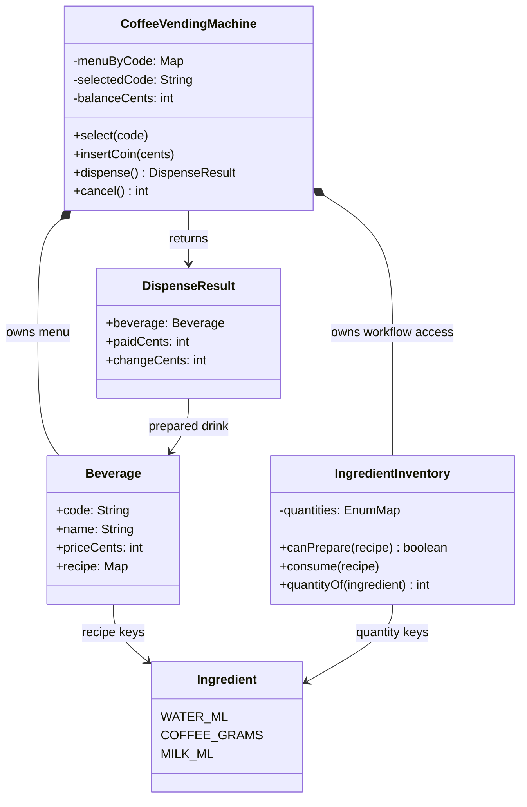
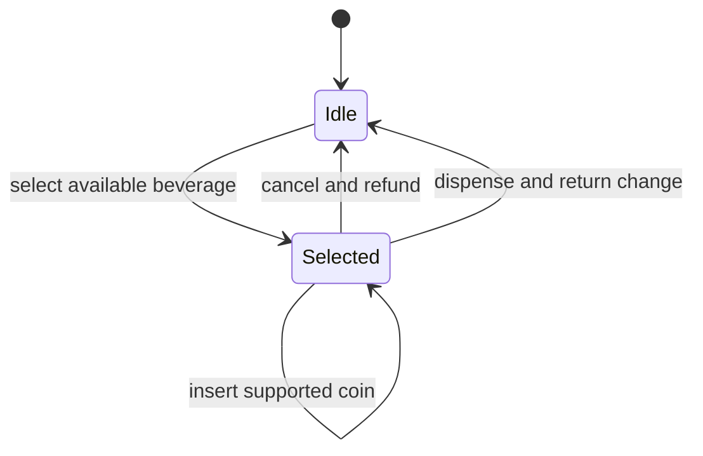

# Design Coffee Vending Machine

> **Interview frame:** 60 minutes · junior candidate · Java 25

## Understanding the Problem

A coffee vending machine offers a small menu, collects money, checks whether the selected drink can be prepared, consumes its recipe, and returns change. The interesting part of the interview is the order of those steps. An unsuccessful purchase must leave both the customer's money and the ingredient stock in a sensible state.

> **Prompt:** Design a coffee vending machine that lets a customer select a drink, insert coins, dispense it, receive change, or cancel the purchase.

### Clarifying Questions

**Candidate:** Which drinks and ingredients should the machine support?

**Interviewer:** Configure the menu when the machine starts. For this exercise, recipes use water in millilitres, coffee in grams, and milk in millilitres.

The menu should contain data rather than recipe-specific branches. `Ingredient` can be an enum because the set is closed for this round. Each recipe maps an ingredient to the required integer amount.

**Candidate:** Are drink customizations such as extra shots or sugar required?

**Interviewer:** No. Each menu entry has one fixed recipe and price.

One immutable `Beverage` record can carry the code, display name, price, and recipe. We do not need add-on classes or a builder.

**Candidate:** How does payment work?

**Interviewer:** Accept coins worth 25, 50, 100, or 200 cents. Prices and balances use integer cents. Assume the machine can always return the calculated change.

This removes floating-point rounding and physical change-coin inventory from the base design. The completed result only needs the amount of change.

**Candidate:** Can money be inserted before a drink is selected?

**Interviewer:** Keep one simple order: select, insert coins, then dispense. The customer may cancel at any point before dispensing.

The machine needs one active selection and one balance. It rejects a second selection until the current session finishes or is cancelled.

**Candidate:** Is brewing asynchronous, and can several customers use the same instance at once?

**Interviewer:** No. Treat preparation as a synchronous simulation for one customer.

We can return the completed drink from `dispense()`. Motor control, brewing progress, timers, and locks would distract from the junior-level object model.

### Final Requirements

1. Configure a menu whose beverage codes are unique.
2. Store a fixed price and ingredient recipe for each beverage.
3. Select one known beverage only when its recipe is currently available.
4. Accept only 25, 50, 100, and 200 cent coins after a selection.
5. Dispense after the inserted balance covers the selected price.
6. Consume every recipe ingredient exactly once on a successful dispense.
7. Return the beverage, total paid, and calculated change, then clear the session.
8. Cancel a purchase, return the inserted balance, and consume no ingredients.
9. Reject invalid operation order, unsupported coins, insufficient payment, or insufficient ingredients without partial ingredient consumption.

### Out of Scope

- heaters, grinders, pumps, sensors, and physical failure handling;
- card authorization and payment settlement;
- tracking the denominations available for change;
- custom drink sizes, extra shots, sugar, or temperature choices;
- administrator authentication and restocking operations;
- persistence, networking, telemetry, and concurrent customers.

## Finding the Core Entities

Some familiar coffee-machine concepts do not earn classes in this contract. A grinder and brewer matter to physical hardware, but the simulation has one synchronous `dispense()` operation. A customer supplies commands and has no stored identity. Coins have no behavior beyond membership in a fixed set of accepted integer values.

| Candidate | Keep as | Reason |
|---|---|---|
| Coffee vending machine | Class | Coordinates the menu, customer session, payment checks, and preparation. |
| Ingredient inventory | Class | Owns mutable quantities and the all-or-nothing consumption rule. |
| Beverage | Immutable record | Carries stable menu data and a recipe. |
| Dispense result | Immutable record | Preserves the completed purchase after the machine resets. |
| Ingredient | Enum | Defines the closed ingredient keys and embeds measurement units in their names. |
| Coin | Integer plus a set | Four fixed values need validation, not an object lifecycle. |
| Customer | Reject | Identity does not affect any requirement. |
| Brewer and grinder | Reject for the base | Hardware execution is outside the synchronous simulation. |

### Responsibilities at a Glance

| Type | Responsibility | State or invariant owned |
|---|---|---|
| `CoffeeVendingMachine` | Public purchase workflow | At most one selected beverage and its balance. |
| `IngredientInventory` | Check and consume recipes | Quantities stay non-negative; failed consumption changes nothing. |
| `Beverage` | Describe one menu option | Positive price and positive recipe amounts. |
| `DispenseResult` | Report one completed purchase | `paidCents - priceCents == changeCents`. |
| `Ingredient` | Give ingredient quantities semantic keys | Each enum name includes its measurement unit. |

## Exploring the Design

### Decision: where should recipe consumption live?

Consider a latte that needs 40 ml of water, 18 g of coffee, and 120 ml of milk. The inventory currently has exactly enough water and coffee but only 100 ml of milk.

#### Bad: decrement ingredients while checking them

A direct implementation inside `dispense()` may look compact:

```text
waterMl -= 40
coffeeGrams -= 18
if milkMl < 120: reject
milkMl -= 120
```

The rejection arrives too late. Water and coffee have already been removed even though no latte was produced. The operation broke the requirement that failure preserve the inventory.

#### Good: validate the full recipe first

The machine can make two passes: first check every amount, then perform every decrement.

```text
require waterMl >= 40
require coffeeGrams >= 18
require milkMl >= 120

waterMl -= 40
coffeeGrams -= 18
milkMl -= 120
```

This is correct for one drink, but each new recipe adds another branch to the purchase orchestrator. The class that manages payment would also know every ingredient field.

#### Great for this scope: let the inventory consume a recipe

Represent a recipe as `Map<Ingredient, Integer>`. `IngredientInventory.consume(recipe)` validates the entire map in one pass and mutates quantities in a second pass. The same operation prepares espresso or latte without changing the machine workflow.

The map adds a small amount of indirection, but it keeps one stock owner and one mutation path. A junior candidate can explain and code both loops within the interview.

**Recommendation:** **Implement in interview.** Keep the generic two-pass consumption method. **Mention if asked:** a richer unit type could prevent mixing grams and millilitres in a larger model.

### Decision: should the machine store an explicit state enum?

An enum with `IDLE`, `SELECTED`, and `READY` seems natural. `READY`, however, depends on the selected beverage's price and the current balance. Every accepted coin could require an extra state update.

The selected code and balance already contain the needed facts:

- no selected code means the machine is idle;
- a selected code means coins may be inserted;
- `balanceCents >= beverage.priceCents()` means dispensing has enough money.

Deriving these conditions avoids a second mutable representation. Each public method still checks whether its transition is legal.

**Recommendation:** **Implement in interview.** Use the two fields. **Production extension:** introduce explicit brewing states when hardware reports asynchronous progress or failure.

## Class Design

### `CoffeeVendingMachine`: purchase orchestrator

`CoffeeVendingMachine` is the only public workflow entry point. It resolves menu codes, enforces operation order, tracks the current payment, and asks the inventory to consume the selected recipe. It does not know how individual ingredient quantities are stored or changed.

| Requirement or invariant | State needed | Why this owner |
|---|---|---|
| Resolve a configured drink | `menuByCode` | The machine owns its selectable menu boundary. |
| Allow one active purchase | `selectedCode` | Selection is customer-session state. |
| Accumulate inserted money | `balanceCents` | Balance spans coin insertions, cancellation, and dispensing. |
| Validate denominations | `SUPPORTED_COINS` | Coin acceptance belongs at the public input boundary. |
| Prepare the selected recipe | `inventory` collaborator | Ingredient mutation belongs to its dedicated owner. |

| Caller need or transition | Method | Result or mutation |
|---|---|---|
| Start a purchase | `select(code)` | Stores one known, available beverage code. |
| Add payment | `insertCoin(cents)` | Validates and increases the active balance. |
| Finish a purchase | `dispense()` | Consumes one recipe, resets the session, and returns the result. |
| Abandon a purchase | `cancel()` | Clears the session and returns the balance. |

```text
class CoffeeVendingMachine
  menuByCode: Map<String, Beverage>
  inventory: IngredientInventory
  selectedCode: String?
  balanceCents: int

  select(code): void
  insertCoin(cents): void
  dispense(): DispenseResult
  cancel(): int
```

**Invariant:** A completed dispense consumes one whole recipe and clears the session. A rejected operation cannot partially consume a recipe.

**Knowledge boundary:** The machine knows recipe requirements through `Beverage`, but it does not access or decrement ingredient fields itself.

**Collaborators:** It reads `Beverage` menu data, delegates stock checks and consumption to `IngredientInventory`, and creates `DispenseResult`.

### `IngredientInventory`: ingredient stock owner

`IngredientInventory` stores the physical ingredient quantities. It is the only class allowed to decrement them. Iterating over the closed `Ingredient` enum gives the validation and mutation passes a stable order.

| Requirement or invariant | State needed | Why this owner |
|---|---|---|
| Track all current quantities | `quantities` enum map | One map is the ingredient source of truth. |
| Decide recipe availability | recipe input plus quantities | The answer depends only on inventory data. |
| Prevent partial consumption | two-pass operation | All amounts are checked before the first decrement. |

| Caller need or transition | Method | Result or mutation |
|---|---|---|
| Check menu availability | `canPrepare(recipe)` | Returns whether every required amount is present. |
| Prepare one drink | `consume(recipe)` | Rejects without mutation or decrements the complete recipe. |
| Inspect deterministic state | `quantityOf(ingredient)` | Supports the demo and correctness tests. |

```text
class IngredientInventory
  quantities: EnumMap<Ingredient, Integer>

  canPrepare(recipe): boolean
  consume(recipe): void
  quantityOf(ingredient): int
```

**Invariant:** Every quantity is non-negative. If one recipe requirement cannot be met, all quantities retain their previous values.

**Knowledge boundary:** The inventory understands ingredient amounts, not menu codes, prices, coins, or customer-session order.

**Collaborators:** It receives immutable recipe maps from a `Beverage`; only `CoffeeVendingMachine` calls it during a purchase.

### `Beverage`: immutable menu entry

`Beverage` represents the stable information needed after a code is selected. Its constructor copies the recipe, so outside code cannot alter the requirements after the beverage joins the menu.

| Requirement or invariant | State needed | Why this owner |
|---|---|---|
| Select by a compact value | `code` | The code identifies the menu entry. |
| Display the chosen drink | `name` | The completed result needs a readable name. |
| Check payment | `priceCents` | Price belongs to the menu entry and uses an explicit unit. |
| Consume ingredients | `recipe` | The fixed recipe defines the beverage. |

| Caller need or transition | Method | Result or mutation |
|---|---|---|
| Create valid menu data | record constructor | Rejects blank text, non-positive price, empty recipe, or invalid amounts. |
| Read menu data | record accessors | Returns immutable state; no mutation method is needed. |

```text
record Beverage
  code: String
  name: String
  priceCents: int
  recipe: Map<Ingredient, Integer>
```

**Invariant:** Price and every recipe amount are positive, and the stored recipe cannot be changed through the caller's map.

**Knowledge boundary:** A beverage does not know inventory quantities, payment state, or preparation order.

**Collaborators:** The machine indexes it; the inventory reads its recipe.

### `DispenseResult` and `Ingredient`: supporting values

`DispenseResult` is an immutable snapshot of a successful purchase. The machine clears its session before accepting another customer, so returning a record keeps the finished values available to the caller. `Ingredient` supplies semantic recipe keys. Its constants include units, such as `WATER_ML` and `COFFEE_GRAMS`, which prevents an unlabeled amount from crossing the API.

| Requirement or invariant | State needed | Why this owner |
|---|---|---|
| Identify the prepared drink | `beverage` | The result describes the completed action. |
| Report payment and change | `paidCents`, `changeCents` | These values remain useful after session reset. |
| Distinguish recipe units | enum constants | The key carries the measurement meaning. |

| Caller need or transition | Method | Result or mutation |
|---|---|---|
| Receive purchase outcome | record accessors | Exposes immutable data with no follow-up mutation. |
| Validate monetary consistency | record constructor | Requires paid amount to cover price and verifies change. |
| Address an ingredient | enum value | Supplies a closed, type-safe map key. |

```text
record DispenseResult
  beverage: Beverage
  paidCents: int
  changeCents: int

enum Ingredient
  WATER_ML
  COFFEE_GRAMS
  MILK_ML
```

**Invariant:** `changeCents` equals `paidCents - beverage.priceCents()`. Ingredient keys always state their unit.

**Knowledge boundary:** These values do not coordinate the purchase or mutate ingredient quantities.

**Collaborators:** `CoffeeVendingMachine` creates the result. `Beverage` and `IngredientInventory` share the ingredient keys.

## Final Class Design



The machine owns the customer session. The inventory owns all mutable ingredient stock. `Beverage` connects them through an immutable recipe, so payment logic never performs ingredient-specific decrements.



The lifecycle is intentionally small. Payment readiness is calculated from the selected price and current balance rather than stored as another state.

## Core Implementation

In a junior interview, the most useful methods to implement are `select`, `IngredientInventory.consume`, and `dispense`. `insertCoin` and `cancel` are short enough to add once the main invariant works. Record accessors and constructor checks belong in the complete solution but need little whiteboard time.

### Operation: select an available beverage

`select(code)` first protects the one-session rule. It then resolves the code and asks the inventory whether the fixed recipe is available. `selectedCode` changes only after all checks pass.

```text
if a selected code already exists: reject
beverage = menuByCode[code]
if beverage is missing: reject
if inventory cannot prepare beverage.recipe: reject
selectedCode = code
```

An unavailable latte does not create a half-started session. The customer may immediately select another menu item.

### Operation: consume a complete recipe

The inventory performs two loops. The first loop is read-only and rejects an unavailable recipe. The second loop executes only after every requirement is known to fit.

```text
for each Ingredient:
    required = recipe amount, or zero
    if quantity < required: reject

for each Ingredient:
    quantity -= recipe amount, or zero
```

This mutation order is the main correctness proof. With water 40, coffee 18, and milk 100, a latte requiring 120 ml of milk fails during the first loop. Water and coffee remain untouched.

### Operation: dispense the selected drink

`dispense()` validates the customer session before asking the inventory to mutate. It builds a valid result, consumes one recipe, and then clears both session fields.

```text
beverage = require active selection
if balance < beverage.price: reject
if inventory cannot prepare recipe: reject

result = DispenseResult(beverage, balance, balance - price)
inventory.consume(recipe)
clear selected code and balance
return result
```

The second availability check matters even though selection checked earlier. The inventory could have changed through maintenance code between selection and dispense. This implementation remains single-threaded; a concurrent version would need one critical section covering the final availability check, consumption, and session reset.

## Complete Runnable Implementation

The solution uses standard Java packages without a framework:

```text
solution/
└── src/
    ├── main/java/coffeevendingmachine/
    │   ├── model/
    │   │   ├── Beverage.java
    │   │   ├── DispenseResult.java
    │   │   ├── Ingredient.java
    │   │   └── IngredientInventory.java
    │   ├── service/
    │   │   └── CoffeeVendingMachine.java
    │   └── demo/
    │       └── Main.java
    └── test/java/coffeevendingmachine/
        └── SolutionTest.java
```

The `model` package owns domain values and ingredient state. `service` contains the public purchase workflow. `demo` and the test root depend on that API; the model never depends on the service.

Source files:

- [`CoffeeVendingMachine.java`](solution/src/main/java/coffeevendingmachine/service/CoffeeVendingMachine.java)
- [`IngredientInventory.java`](solution/src/main/java/coffeevendingmachine/model/IngredientInventory.java)
- [`Beverage.java`](solution/src/main/java/coffeevendingmachine/model/Beverage.java)
- [`DispenseResult.java`](solution/src/main/java/coffeevendingmachine/model/DispenseResult.java)
- [`Ingredient.java`](solution/src/main/java/coffeevendingmachine/model/Ingredient.java)
- [`Main.java`](solution/src/main/java/coffeevendingmachine/demo/Main.java)
- [`SolutionTest.java`](solution/src/test/java/coffeevendingmachine/SolutionTest.java)

Run from `solution/`:

```bash
mkdir -p out
javac -d out $(find src/main/java src/test/java -name '*.java' | sort)
java -ea -cp out coffeevendingmachine.SolutionTest
java -cp out coffeevendingmachine.demo.Main
```

Verified with `javac 25.0.4.1`:

```text
All coffee vending machine tests passed.
Dispensed Latte; change: 50 cents; milk remaining: 380 ml
```

The matching PDF contains this same article followed by every source and test file in **Appendix: Complete Runnable Code**.

## Verification Walkthrough

Start with a latte priced at 250 cents. Its recipe needs 40 ml water, 18 g coffee, and 120 ml milk. Inventory starts with 500 ml water, 100 g coffee, and 500 ml milk.

1. `select("LAT")` resolves the latte and asks `IngredientInventory.canPrepare(recipe)`. All quantities fit, so the machine stores `LAT`. Inventory has not changed.
2. `insertCoin(200)` and `insertCoin(100)` move the session balance to 300 cents.
3. `dispense()` validates the 250-cent price and checks the recipe again. It creates a result with 50 cents change.
4. `IngredientInventory.consume(recipe)` completes its validation pass, then decrements all three quantities. Water becomes 460, coffee becomes 82, and milk becomes 380.
5. The machine clears the selected code and balance, then returns the latte result.
6. An immediate second `dispense()` is rejected because no selection exists. Ingredient quantities remain at the values from the one successful drink.

The automated tests also prove that insufficient payment preserves every ingredient, cancellation returns the balance without preparing a drink, an invalid coin adds no money, an unavailable latte cannot be selected, duplicate menu codes are rejected, and a failed multi-ingredient consumption changes nothing.

## Extensibility

### Track physical change coins

Add a `ChangeInventory` that can both calculate and reserve a denomination combination. `dispense()` must verify drink ingredients and change availability before either resource changes. That creates a larger atomic operation and belongs beyond the junior base.

### Add drink customizations

Represent a customer order separately from the configured `Beverage`. The order can derive an adjusted recipe and price for an extra shot or different size. The existing inventory API can still consume the resulting recipe map.

### Model real brewing progress

Introduce states such as `HEATING`, `GRINDING`, `BREWING`, `DISPENSING`, and `FAILED` only when hardware reports asynchronous events. A controller would then advance legal transitions and decide how to refund after failure.

### Support restocking

Add `restock(ingredient, amount)` to `IngredientInventory` and keep administrator authorization outside the domain model. The customer purchase API remains unchanged.

## What Is Expected at Each Level

### Junior

A strong junior solution should identify the machine, beverage, and ingredient inventory; use integer money; keep quantities non-negative; validate the full recipe before decrementing anything; and demonstrate both a successful purchase and rejected operations. A map-based recipe and four public machine operations are enough. Strategy, State, Factory, and hardware classes are unnecessary for this contract.

An interviewer may hint that ingredient consumption needs two passes or that money should use integer cents. After that hint, the candidate should be able to finish the workflow and tests.

### Mid-level

A mid-level candidate should reach the all-or-nothing recipe invariant without prompting, defend the source of truth for inventory, copy immutable recipe data, and explain how change inventory would expand the transaction boundary.

### Senior

A senior candidate should clarify concurrent sessions and physical failure semantics early. They should describe how to reserve ingredients and change atomically, how an asynchronous brewer reports completion, and which guarantees remain local versus distributed. Those concerns should stay out of the junior implementation unless the interviewer changes the contract.
