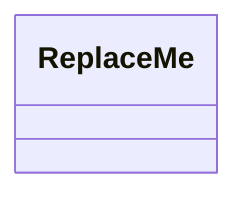

# Design {{TITLE}}

> **Interview frame:** {{TIMEBOX}} minutes · {{CANDIDATE_LEVEL}} candidate · {{LANGUAGE}}

## Understanding the Problem

State the short prompt, the initial ambiguity, and the interview-sized interpretation.

### Clarifying Questions

Write a compact candidate/interviewer dialogue. After meaningful answers, add the immediate design consequence.

### Final Requirements

1. List the supported behavior.
2. Include lifecycle and invalid-action rules.

### Out of Scope

- Name excluded production concerns and plausible extensions.

## Core Entities and Responsibilities

Explain why each retained entity deserves to exist. Identify the public orchestrator and invariant owners.

| Entity | Responsibility | State or invariant owned |
|---|---|---|
| `Example` | Replace this row | Replace this row |

## Exploring the Design

### Decision 1: Replace with a real pressure point

#### Bad: A plausible first attempt

Show why it is attractive, then break it with a concrete scenario.

#### Good: The minimal repair

Change the dimension responsible for the failure, replay the scenario, and state the cost.

#### Great: Best fit for these constraints

Include this section only when a distinct, justified option exists. Great may be simpler than Good.

**Recommendation:** Implement in interview / Mention if asked / Production extension.

## Class Design

Derive the orchestrator first, then supporting classes from requirements and invariants.

## Final Class Design

Consolidate the selected classes, important fields, and method signatures in code-shaped notation.

## Core Implementation

Explain two to four revealing operations.

### Operation 1

Cover the happy path, invalid states, validation order, pseudocode, delegation, and mutation order.

## Complete Runnable Implementation

Point to the real files under `solution/`. State exact compile, test, and demo commands.

## Verification Walkthrough

Replay one concrete scenario and connect each step to its owner, mutation, invariant, and result.

## Extensibility

Explain two to four likely follow-ups and the localized changes each would require.

## What Is Expected at Each Level

### Junior

State the minimum coherent solution.

### Mid-level

State the expected ownership, alternatives, and edge-case reasoning.

### Senior

State the expected tradeoff, concurrency, and extension judgment without demanding production architecture.
