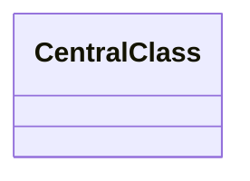

# Design {{TITLE}}

> **Interview frame:** {{TIMEBOX}} minutes · {{CANDIDATE_LEVEL}} candidate · {{LANGUAGE}}

## Understanding the Problem

Give the short domain primer and the interview-sized interpretation.

> **Prompt:** State the deliberately short question.

### Clarifying Questions

Write a compact candidate/interviewer dialogue. After a meaningful answer, explain the immediate consequence for the design.

### Final Requirements

1. List observable supported behavior.
2. Include lifecycle rules, invalid actions, and any important invariant.

### Out of Scope

- Name excluded production concerns and plausible extensions.

### Setup Assumptions

State which values are trusted demo configuration and which inputs are runtime caller choices. Use this boundary to decide what needs validation.

## Finding the Core Entities

Classify the useful nouns. Explain why central classes remain and why tempting concepts become values, enums, fields, constants, parameters, or external concerns.

| Candidate | Keep as | Reason |
|---|---|---|
| `CandidateName` | Class / record / enum / field / reject | Requirement or invariant that justifies the choice |

### Responsibilities at a Glance

| Type | Responsibility | State or invariant owned |
|---|---|---|
| `CentralType` | Public workflow or domain responsibility | Authoritative mutable fact |

## Exploring the Design

### Decision: Name a consequential pressure point

Present only the alternatives the decision genuinely needs. A design may use Bad → Great, Good → Great, Bad → Good → Great, an unlabeled options table, or no ladder at all.

Run one concrete scenario through the alternatives and select the least complex option that satisfies the contract.

**Recommendation:** Implement in interview / Mention if asked / Production extension.

## Class Design

Derive every central class. Repeat this subsection for each one; group only tiny records, enums, exceptions, and helpers.

### `CentralClass`: responsibility

Explain why it exists, what it owns, and what it must not know.

| Requirement or invariant | State needed | Why this owner |
|---|---|---|
| Replace with a problem-specific fact | `fieldName` | Ownership reason |

| Caller need or transition | Method | Result or mutation |
|---|---|---|
| Replace with a problem-specific action | `methodName(...)` | What changes or returns |

```text
class CentralClass
  field: Type
  operation(input): Result
```

**Invariant:** State the rule this class preserves.
**Collaborators:** Name only direct collaborators and why they are needed.

## Final Class Design

Consolidate the selected fields, methods, interfaces, enums, and relationships in compact notation.



Explain the ownership or call boundary the reader should notice.

## Core Implementation

Explain two to four revealing operations. Give the most space to the operation that protects the main invariant.

### Operation: Name the workflow

Cover the happy path, relevant illegal states, validation order, pseudocode, delegation, and mutation order.

## Complete Runnable Implementation

Point to the real packaged files under `solution/`. Explain the directory boundaries and give exact compile, test, and demo commands plus their observed outcomes.

State the size of all application files plus the short demo, and a credible typing/explanation budget. Keep that entire implementation small enough for the round. Label additional focused tests as study support; do not hide extra application logic in the appendix.

The PDF generated from this Markdown adds every source, test, and required build file in **Appendix: Complete Runnable Code**.

## Verification Walkthrough

Replay one concrete scenario. Connect each call to its validator, state read, mutation, invariant, and result.

## Extensibility

Explain two to four likely follow-ups and the smallest localized change each requires.

## What Is Expected at Each Level

### Junior

State the minimum coherent solution and the hints an interviewer may provide.

### Mid-level

State the expected ownership, alternatives, and edge-case reasoning.

### Senior

State the expected tradeoff, concurrency, failure, and evolution judgment without demanding production architecture.
