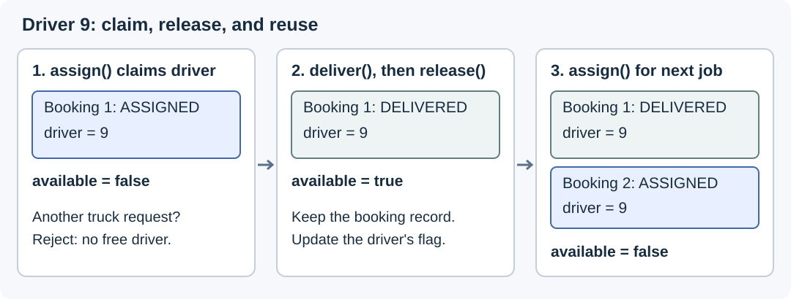
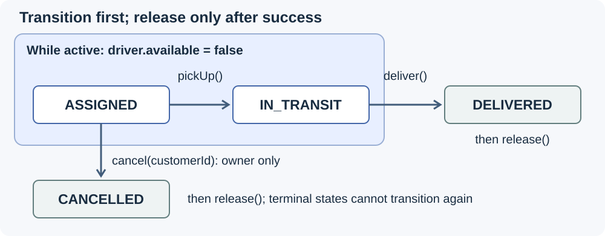
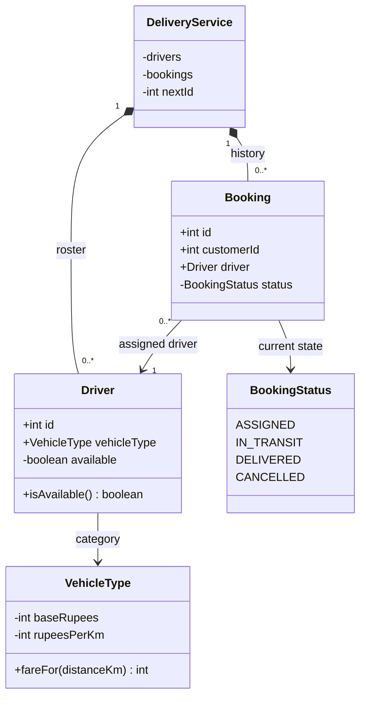

# Design Porter

> **Interview frame:** 60 minutes · junior candidate · Java · in-memory, sequential calls

## Understanding the Problem

A shop owner books a mini truck to move goods from Indiranagar to Koramangala. Driver 9 gets the job. A second customer asks for a truck while that delivery is underway. Driver 9 must not be assigned twice, but should become available as soon as the first delivery ends.

Now imagine the service has retained a year's worth of completed bookings. Should finding a free driver require reading all of them? **Current availability belongs on the driver. Booking history should not make each new allocation more expensive.**

Porter's public booking flow includes choosing pickup and drop locations and a vehicle category for transporting goods. This article models that local-delivery slice. [Porter's official overview](https://porter.in/) supplies the product context; our matching rules, lifecycle, cancellation policy, and numerical fares are interview assumptions, not Porter's internal design or current prices.

> **Prompt:** Design a Porter-like service that books local goods deliveries, assigns available drivers, and tracks each booking until delivery or cancellation.

### Clarifying Questions

**Candidate:** Do we support scheduled requests or immediate bookings?

**Interviewer:** Immediate bookings only. Choose the first available driver with the exact requested vehicle type. Reject the request if none is available.

We need a deterministic roster scan, with no waiting queue. Every successful booking already has a driver.

**Candidate:** Must the driver be nearby, and do they need to accept the request?

**Interviewer:** Ignore distance-based matching and driver acceptance. All rostered drivers are ready for work unless occupied by a booking.

A single availability flag can describe whether a driver can take the next job. Online/offline status would be a separate concern if we later introduced it.

**Candidate:** What happens after assignment? Can the customer cancel?

**Interviewer:** Assignment is followed by pickup and delivery. Only the booking's customer can cancel, and only before pickup. Keep completed and cancelled bookings for lookup.

This gives us four booking states. Finishing a delivery or cancelling before pickup must also free the driver, without deleting the booking.

**Candidate:** How do we represent locations and calculate the fare?

**Interviewer:** Store pickup and drop labels. Accept a trip distance from the caller and calculate a fixed base fare plus a per-kilometre rate for the selected category.

No map service is needed. Store the accepted fare on the booking so later queries do not recalculate it.

**Candidate:** What scale and concurrency should we handle?

**Interviewer:** One call at a time, in memory. Keep historical bookings, but don't scan them to find a free driver. Skip accounts, payments, and network APIs.

The allocation work can depend on the driver roster, while history is kept separately for ID lookup. Concurrency will be a follow-up, since an ordinary boolean does not make two simultaneous bookings safe.

### Final Requirements

1. Accept a customer ID, pickup, drop, vehicle type, and positive distance for a delivery.
2. Assign the first available driver of the requested type. A driver can have **at most one active booking**.
3. Reject unavailable or invalid requests without creating a booking, consuming an ID, or changing driver availability.
4. Calculate and store the fare when the booking succeeds.
5. Support `ASSIGNED → IN_TRANSIT → DELIVERED`, and customer-owned cancellation from `ASSIGNED` only. Delivery and cancellation make the driver available again.
6. Retain bookings and retrieve their details and status by ID. Unknown IDs and illegal transitions must leave state unchanged.
7. Allocate using the driver roster, without scanning historical bookings or rebuilding a busy-driver set.

### Out of Scope

- GPS, route computation, nearest-driver selection, and arrival estimates.
- Driver acceptance, offline status, reassignment, scheduled bookings, and capacity checks.
- Payments, cancellation fees, accounts, ratings, and notifications.
- Databases, multiple service instances, and concurrent calls in the base solution.

### Setup Assumptions

The demo creates a roster with unique IDs and one fixed vehicle type per driver. These driver objects belong to one `DeliveryService`; do not share the mutable roster across independent services. A driver starts available, and this service is the only component that assigns or releases it.

Customer IDs come from an authenticated caller. Pickup and drop labels have already been selected and validated upstream. Pickup and delivery events come from a trusted operations layer; event authorization is outside this exercise. Example distances and fares are small whole numbers.

We validate runtime choices and domain failures: missing vehicle choice, nonpositive distance, unavailable drivers, unknown booking IDs, cancellation ownership, and transition order. Trusted driver configuration does not need a collection of defensive constructor checks.

## Finding the Core Entities

Two things change: a booking's progress and a driver's availability. They need distinct owners, plus a service that coordinates them.

| Candidate | Keep as | Reason |
|---|---|---|
| Delivery service | `DeliveryService` class | Selects drivers and coordinates booking/availability changes. |
| Booking | `Booking` class | Stores accepted details and protects the delivery lifecycle. |
| Driver | `Driver` class | Keeps identity, vehicle category, and mutable availability. |
| Vehicle category | `VehicleType` enum | Two categories use the same fare formula with different constants. |
| Booking state | `BookingStatus` enum | Names the four legal states. |
| Customer | Integer ID | Cancellation needs ownership, not an account model. |
| Vehicle and location | Category and labels | No registration, location updates, or routing behavior is required. |

### Responsibilities at a Glance

| Type | Responsibility | State or invariant owned |
|---|---|---|
| `DeliveryService` | Public booking and lifecycle workflow | Roster, booking map, ID sequence; synchronization across objects. |
| `Driver` | Current allocation availability | Private `available` flag; fixed ID and vehicle type. |
| `Booking` | One delivery's details and legal transitions | Private `status`; fixed customer, driver, locations, and fare. |
| `VehicleType` | Example fare calculation | Fixed base and per-kilometre rates. |
| `BookingStatus` | Lifecycle vocabulary | Four values, with transition behavior in `Booking`. |

## Exploring the Design

### Decision: Read current availability directly

Selecting a truck by category alone would assign Driver 9 to both customers. We also need to know whether that driver is occupied.

One correct approach is to scan all bookings, collect drivers on active bookings, then select someone outside that set. It avoids an availability flag, but the work grows with history. Even with only 20 drivers, 100,000 completed bookings would still be visited on every request.

Instead, store `available` on `Driver`. The service checks that flag during selection, sets it to `false` on assignment, and restores it to `true` after a successful delivery or cancellation.



*Figure 1. Availability follows the driver's current allocation. Old bookings retain their driver reference without controlling the flag.*

| Approach | Work per allocation | Maintenance cost |
|---|---|---|
| Scan bookings and build occupied-driver IDs | Expected `O(B + D)` time; `O(A)` temporary space | No stored availability to synchronize. |
| Store a flag on each driver | `O(D)` selection time; `O(1)` auxiliary selection space | Update the flag on assignment, delivery, and cancellation. |

Here `B` is retained bookings, `D` is roster size, and `A` is active drivers. Both approaches retain the booking records themselves. The flag removes the history scan and temporary set; it does not remove `O(B)` history storage or the need to scan the roster.

**Implement in interview:** use the flag. Maintaining three write paths is a reasonable cost for keeping allocation independent of historical volume. An index of available drivers could reduce roster search later, at the cost of another structure to maintain.

### Decision: One service coordinates both state changes

The flag and booking status must agree. At the end of every public service operation, **a driver is available exactly when it has no `ASSIGNED` or `IN_TRANSIT` booking**, and no driver has more than one such booking.

The subtle case is an old command. Suppose booking 1 is cancelled, Driver 9 takes booking 2, and the customer repeats cancellation of booking 1. Releasing the driver before checking the old booking would incorrectly make Driver 9 available for a third customer.

The safe order is short: find the booking, validate and perform its transition, then release its driver. A rejected transition stops before the release. This ordering will be visible in both the implementation and tests.

## Class Design

### `DeliveryService`: coordinate allocation and release

The caller should not have to change a booking and remember to release its driver separately. One public entry point handles the complete workflow.

| Requirement | State needed | Why this owner? |
|---|---|---|
| First matching available driver | `List<Driver> drivers` | Preserves deterministic roster order. |
| Retain and find bookings | `Map<Integer, Booking> bookings` | Supports ID lookup without a history scan. |
| Identify successful requests | `int nextId` | Advances only when the new booking is stored. |

`book` selects and assigns. `pickUp`, `deliver`, and `cancel` resolve an existing booking and delegate its lifecycle checks. The two terminal operations then release the associated driver. `booking` serves the required query and centralizes the unknown-ID check.

```text
class DeliveryService
  private drivers: List<Driver>
  private bookings: Map<Integer, Booking>
  private nextId: int = 1

  book(customerId, pickup, drop, type, distanceKm): Booking
  booking(bookingId): Booking
  pickUp(bookingId): void
  deliver(bookingId): void
  cancel(customerId, bookingId): void
```

**Owned invariant:** each public operation leaves booking status and driver availability consistent. `DeliveryService` alone coordinates their mutations. It asks `Booking` to enforce transition rules and `VehicleType` to calculate a fare; it knows nothing about road routes or payment processing.

The roster list is copied at construction, but its driver objects are deliberately shared with bookings. Every booking for Driver 9 must refer to that same driver object so there is only one availability flag for it.

### `Driver`: a small mutable resource

The service needs to distinguish drivers, filter by vehicle type, and test whether a driver can accept work. Identity and category are immutable. The only mutable state is the private `available` field, initially `true`.

Use a class rather than an immutable record because availability changes. Callers may read `isAvailable()`. Only domain code can call `assign()` and `release()`; there is no public setter that can free a driver behind the service's back.

```text
class Driver
  public final id: int
  public final vehicleType: VehicleType
  private available: boolean = true

  public isAvailable(): boolean
  package assign(): void      // available = false
  package release(): void     // available = true
```

`Driver` owns the flag; the service owns when it may change. In the sequential implementation, `assign` need not repeat the availability check already performed by the service. `release` relies on the service first completing a valid terminal transition. These package-private operations are trusted collaborators, not independent customer-facing APIs.

We call the flag `available`, since “active driver” could mean online or on duty. The driver stores no booking history and does not decide whether a customer is allowed to cancel.

### `Booking`: protect the delivery lifecycle

A booking remembers its ID, customer, driver, pickup, drop, and accepted fare. All are fixed after creation. Its private `status` starts at `ASSIGNED` and changes only through named commands.



*Figure 2. Validate the booking transition first. Release its driver once, immediately after successful delivery or cancellation.*

```text
class Booking
  public final id, customerId: int
  public final driver: Driver
  public final pickup, drop: String
  public final fareRupees: int
  private status: BookingStatus = ASSIGNED

  public status(): BookingStatus
  package pickUp(): void
  package deliver(): void
  package cancel(customerId): void
  private moveFrom(expected, next): void
```

`pickUp` requires `ASSIGNED`; `deliver` requires `IN_TRANSIT`. `cancel` first checks the customer and then requires `ASSIGNED`. The private `moveFrom` helper shares the state check. There is no general `setStatus`, and terminal states have no outgoing transitions.

**Owned invariant:** only the three diagrammed transitions can change this booking. Its constructor and mutators are package-private, so ordinary callers use the service. `Booking` never writes driver availability itself; keeping that coordination in the service makes the update order explicit.

A completed booking still references Driver 9. If Driver 9 later takes another job, reading that driver's availability through the old booking returns its current value. Booking status describes the historical delivery; the driver's flag describes the resource now.

### Supporting enums: categories and states

`VehicleType` contains two categories, their fixed rates, and `fareFor(distanceKm)`. Both categories use the same formula, so separate vehicle subclasses and pricing strategies would add no useful behavior.

| Vehicle type | Base fare | Per kilometre | Example for 5 km |
|---|---|---|---|
| `TWO_WHEELER` | INR 30 | INR 8 | INR 70 |
| `MINI_TRUCK` | INR 150 | INR 20 | INR 250 |

These are fictional whole-rupee rates. The formula is `baseRupees + rupeesPerKm * distanceKm`. The service validates distance before calculation and stores the result on `Booking`.

`BookingStatus` provides four names for booking state. It has no transition methods because the current status and cancellation owner are already together in `Booking`.

```text
enum VehicleType
  TWO_WHEELER(30, 8), MINI_TRUCK(150, 20)
  private baseRupees, rupeesPerKm: int
  fareFor(distanceKm): int

enum BookingStatus
  ASSIGNED, IN_TRANSIT, DELIVERED, CANCELLED
```

## Final Class Design

The diagram emphasizes ownership and changing state; the full interfaces are above. Both the roster and retained bookings refer to the same driver objects.



Many historical bookings may reference one driver. The stricter rule, at most one active booking, is maintained by the service's allocation and release workflow. The roster belongs exclusively to this service under our setup contract.

## Core Implementation

### 1. Select and assign a driver

The allocation path reads only the roster. Construct the booking after validating input and finding a match; then claim the driver and store the result.

```text
book(customerId, pickup, drop, type, distanceKm):
  reject a missing type or nonpositive distance
  scan drivers in roster order
    if vehicle type matches and driver.isAvailable():
      calculate fare and construct the assigned booking
      driver.assign()
      store booking, advance nextId, and return it
  reject because no matching driver is available
```

The complete Java method is short enough to type directly:

```java
public Booking book(int customerId, String pickup, String drop,
                    VehicleType type, int distanceKm) {
    if (type == null || distanceKm <= 0) {
        throw new IllegalArgumentException("Choose a vehicle and a positive distance");
    }
    for (Driver driver : drivers) {
        if (driver.vehicleType == type && driver.isAvailable()) {
            Booking booking = new Booking(nextId, customerId, driver,
                    pickup, drop, type.fareFor(distanceKm));
            driver.assign();
            bookings.put(nextId++, booking);
            return booking;
        }
    }
    throw new IllegalStateException("No available driver");
}
```

For the second truck request, Driver 9's flag is already `false`. The scan finds no match, so neither the map, ID sequence, nor any flag changes. Every expected rejection is checked before the first mutation. No external call occurs between claiming the driver and recording the booking.

The driver scan takes `O(D)` time and `O(1)` auxiliary space; hash-map insertion is expected amortized constant-time. Selection reads no booking history. Keeping that history still costs `O(B)` memory, so this is a focused allocation improvement rather than a complete production-scale dispatcher.

### 2. Finish or cancel, then release

Lookup can fail because a caller supplies an unknown ID. After lookup succeeds, the booking validates its own transition. **Release must happen after that validation, never before it or in a `finally` block.**

```text
deliver(id):
  find booking or reject unknown ID
  booking.deliver()         // require IN_TRANSIT, then set DELIVERED
  booking.driver.release()

cancel(customerId, id):
  find booking or reject unknown ID
  booking.cancel(customerId) // require owner and ASSIGNED, then set CANCELLED
  booking.driver.release()
```

The service's code exposes the ordering:

```java
public void deliver(int bookingId) {
    Booking booking = booking(bookingId);
    booking.deliver();
    booking.driver.release();
}

public void cancel(int customerId, int bookingId) {
    Booking booking = booking(bookingId);
    booking.cancel(customerId);
    booking.driver.release();
}
```

Inside `Booking`, cancellation checks ownership before its guarded transition:

```java
void cancel(int customerId) {
    if (customerId != this.customerId) {
        throw new IllegalArgumentException("Only the booking customer can cancel");
    }
    moveFrom(BookingStatus.ASSIGNED, BookingStatus.CANCELLED);
}

private void moveFrom(BookingStatus expected, BookingStatus next) {
    if (status != expected) {
        throw new IllegalStateException("Cannot change " + status + " to " + next);
    }
    status = next;
}
```

Now replay the stale cancellation: booking 1 is already `CANCELLED`, so `moveFrom` throws. Execution never reaches `release`; Driver 9 remains unavailable for booking 2. Pickup is simpler: it changes `ASSIGNED` to `IN_TRANSIT` and leaves availability `false`.

The synchronization guarantee is at public method boundaries under sequential calls. The intermediate status/flag assignments are not a transaction that other threads can safely observe. We address that changed assumption in the concurrency follow-up.

## Complete Runnable Implementation

The full application is **183 lines including imports, blank lines, and the 34-line demo**. The additional 138-line test file is study support. It proves the invariants but does not add application behavior to the interview typing budget. The solution uses only the Java standard library; verification used Java 25.

```text
solution/
  src/main/java/porter/
    domain/
      DeliveryService.java
      Driver.java
      Booking.java
      VehicleType.java
      BookingStatus.java
    demo/
      Main.java
  src/test/java/porter/
    SolutionTest.java
```

The small group of domain collaborators shares `porter.domain`, allowing package-private mutation. The demo and tests sit outside that package and use the public service API. This boundary keeps `Driver.assign/release` and `Booking` transitions unavailable to an ordinary caller without adding layers or interfaces.

Source files: [DeliveryService.java](solution/src/main/java/porter/domain/DeliveryService.java), [Driver.java](solution/src/main/java/porter/domain/Driver.java), [Booking.java](solution/src/main/java/porter/domain/Booking.java), [VehicleType.java](solution/src/main/java/porter/domain/VehicleType.java), [BookingStatus.java](solution/src/main/java/porter/domain/BookingStatus.java), [Main.java](solution/src/main/java/porter/demo/Main.java), and [SolutionTest.java](solution/src/test/java/porter/SolutionTest.java).

From `solution/`, compile and run:

```bash
mkdir -p out
javac -Xlint:all -d out $(find src/main/java src/test/java -name '*.java' | sort)
java -ea -cp out porter.SolutionTest
java -cp out porter.demo.Main
```

Compilation completes without warnings. Observed output:

```text
6 focused tests passed
Booking #1: driver=9, fare=INR 250, ASSIGNED, available=false
Second truck request: No available driver
Booking #1: DELIVERED, available=true
Booking #2: driver=9, fare=INR 230, ASSIGNED, available=false
```

Keep `-ea` for the tests so Java assertions execute. The demo's 5 km distance is a supplied example, not a measured route between the named locations.

Budget roughly 5 minutes for scope, 10 for classes and the availability invariant, 30 for the application and demo, 10 for verification, and 5 for a follow-up. The whole implementation belongs in that budget, including the small driver class and lifecycle helpers.

The matching PDF is built from this Markdown and adds **Appendix: Complete Runnable Code** with every source/test file, its relative path, and a checksum manifest. It is sufficient to recreate and run the solution without opening a separate file.

## Verification Walkthrough

Begin with Driver 7 on a two-wheeler and Driver 9 on a mini truck. Both flags are `true`.

| Call | Validation and mutation | Visible result |
|---|---|---|
| Customer 10 books a truck for 5 km | Skip Driver 7; find Driver 9 available. Create booking 1, assign driver, store booking. | Booking 1 `ASSIGNED`, INR 250; Driver 9 unavailable. |
| Customer 20 requests a truck | Driver 9 is unavailable; there is no second truck. | Reject; no new booking or ID consumed. |
| `pickUp(1)` | Booking requires `ASSIGNED`, then changes status. | `IN_TRANSIT`; driver still unavailable. |
| `deliver(1)` | Booking requires `IN_TRANSIT`. After the transition, service releases Driver 9. | `DELIVERED`; driver available. |
| Customer 20 books a truck for 4 km | Driver 9 is available again; assign and store booking 2. | `ASSIGNED`, INR 230; driver unavailable. |
| An old `deliver(1)` arrives | Booking 1 is terminal, so its transition throws before release. | Booking 2 and the unavailable flag remain unchanged. |

Both bookings reference Driver 9, while only booking 2 is active. The test suite repeats this idea for cancellation and explicitly checks the flag after rejected commands.

| Focused test | What it demonstrates |
|---|---|
| Matching and fares | Exact category, roster order, occupied drivers skipped, correct fares, failed request consumes no ID. |
| Delivery and reuse | Pickup keeps the driver occupied; successful delivery frees it; stale commands after reuse cannot free it again. |
| Cancellation and stale requests | Wrong customer cannot cancel; successful cancellation frees the driver; repeated cancellation cannot release a later booking. |
| Invalid booking input | Missing type and nonpositive distance leave availability and IDs unchanged. |
| Unknown booking IDs | Failed lookups cannot change a real booking or its driver's flag. |
| Retained history and reuse | After 1,000 completed deliveries, an old booking remains queryable and the same driver serves booking 1,001. |

The last test checks behavior with history, not a timing guarantee. The complexity claim comes from inspecting `book`: its only loop visits `drivers`; it never iterates through `bookings`.

## Extensibility

These sketches are **not implemented** in the runnable junior solution. Each changes one requirement while retaining the same lifecycle checks.

### “Can we select the nearest available driver?”

**Mention if asked.** Replace the first-match loop in `DeliveryService` with a minimum-distance scan. Add a current coordinate per driver and a pickup coordinate to the request. For this sketch, assume valid coordinates on a small local Cartesian map; squared straight-line distance is enough to rank candidates.

```text
after validating the request:
  best = none
  bestDistance = infinity
  for driver in roster:
    if driver.vehicleType != requestedType: continue
    if not driver.isAvailable(): continue
    point = currentPositions[driver.id]
    if point is missing: continue
    dx = point.x - pickupPoint.x
    dy = point.y - pickupPoint.y
    distanceSquared = dx * dx + dy * dy
    if distanceSquared < bestDistance:
      best = driver
      bestDistance = distanceSquared
  reject if best is none
  calculate fare and construct booking with best
  best.assign(); store booking; advance nextId; return booking
```

A nearby busy driver is skipped in favor of a farther available one. Equal distances keep roster order. The position map adds `O(D)` storage, and selection remains `O(D)` without consulting history. Position updates, stale locations, and real road travel times are new integration concerns; the stored trip fare still uses the supplied trip distance.

### “What if two customers book simultaneously?”

**Mention if asked.** Two threads can both read `Driver 9.available == true` before either calls `assign`. Merely making the flag `volatile` or using a thread-safe booking map does not make the entire check-and-assign operation atomic.

For one process, add a lock owned by `DeliveryService`. All public operations use it. The lock must cover validation, driver selection, claiming, and storing the booking, as well as each terminal transition and release.

```text
DeliveryService owns one lock
Construct internal Driver objects from immutable roster definitions

book(inputs):
  with lock:
    validate inputs
    select first matching driver with isAvailable(), or reject
    calculate fare and construct booking
    driver.assign(); store booking; advance nextId
    return immutable snapshot of booking and driver details

pickUp / deliver / cancel(inputs):
  with lock:
    resolve the booking or reject
    invoke its existing guarded transition
    after successful deliver or cancel only: driver.release()

booking(id):
  with lock:
    resolve the booking or reject
    return immutable snapshot of booking and driver details
```

The return value must stop exposing live mutable `Booking` and `Driver` objects. In this extension, the service also creates and exclusively keeps its internal driver objects, rather than accepting caller-held mutable drivers. Snapshots copy scalar values, including status and availability, while holding the lock. This prevents callers from reading a half-updated pair through a retained object reference.

With the complete boundary protected, the second request sees the first driver's claim and chooses another driver or fails. The cost is serialized operations. A targeted test would start two requests together and require exactly one success when only one truck is free. Multiple service processes would need shared coordination beyond this lock.

## What Is Expected at Each Level

### Junior

Implement the roster scan, fare, lifecycle, and explicit availability flag within the round. Explain all three flag-write paths and why transition validation precedes release. Trace a failed second booking and a stale cancellation after reassignment. A small working model with these rules is sufficient; a strategy hierarchy or dispatch infrastructure adds little here.

### Mid-level

Establish the synchronization invariant independently, distinguish roster size from history size, and identify the full concurrent critical section. Discuss when a per-category available-driver index becomes worthwhile and which write paths would have to maintain it.

### Senior

Clarify driver acceptance, retries, timeouts, contention, and process boundaries before enlarging the design. Justify the resource-claim mechanism and preserve lifecycle correctness as new failure modes appear. Keep those concerns proportional to the interview's agreed scope.
