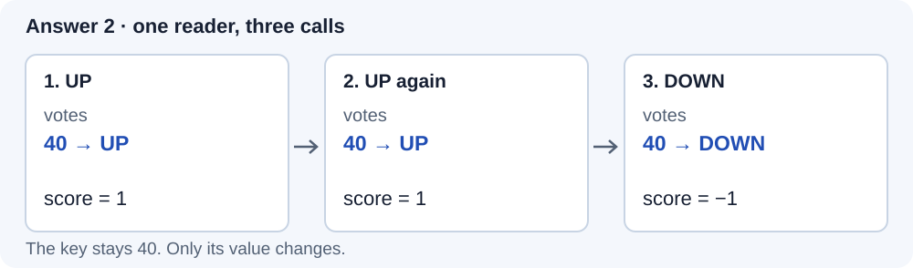
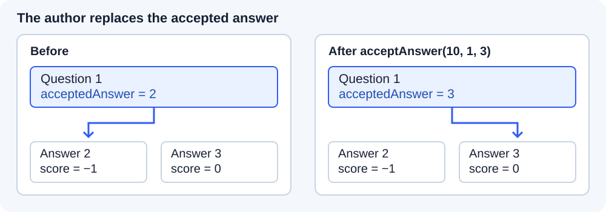
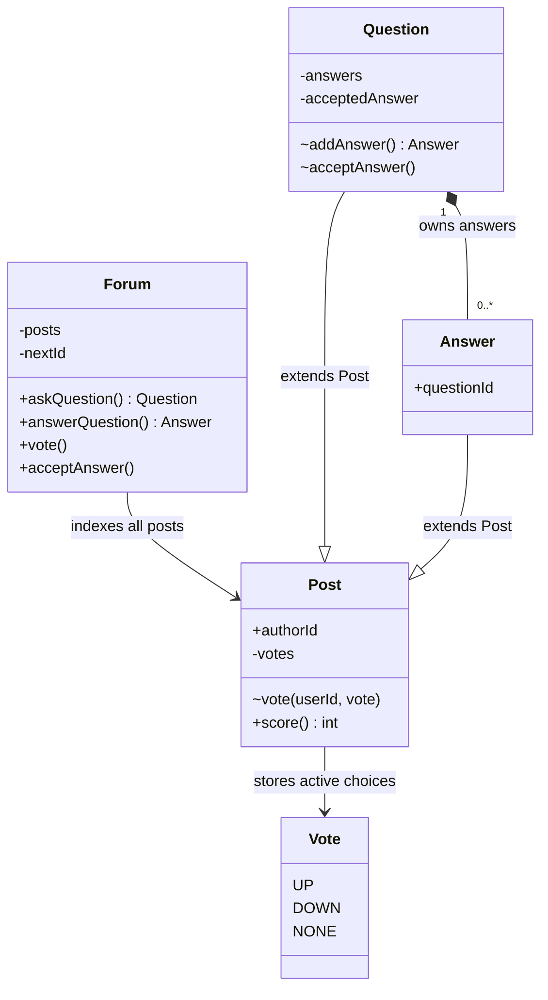

# Design Stack Overflow

> **Interview frame:** 60 minutes | Mid-level, approximately 4 years of experience | Java

## Understanding the Problem

A developer asks question 1 and receives answers 2 and 3. A reader upvotes answer 2 twice, then changes to a downvote. What should its score be? Later, the question author accepts answer 3. Should that change either score?

Those few actions expose the two decisions at the heart of this problem: **a vote is a user's current choice**, and **acceptance is the question author's separate decision**. We will follow this small example from the requirements through the working code. No knowledge of the website's full feature set is needed.

> **Prompt:** Design the core of a Stack Overflow-style question-and-answer system.

We will build an in-memory domain component. Four years of experience is treated as mid-level for this exercise; actual interview expectations vary. The rules below are our agreed interview contract, not a claim to reproduce the website's complete policies.

### Clarifying Questions

**Candidate:** Which actions should we finish in this round?

**Interviewer:** Ask a question, answer it, read it with its answers, vote on either kind of post, and accept an answer.

Reading returns answers in posting order. Comments, search, reputation, and ranking can wait.

**Candidate:** What happens if someone votes twice or changes their mind?

**Interviewer:** Each user has at most one active vote per post. They can choose upvote, downvote, or no vote. Repeating the same choice has no additional effect. Self-voting is rejected.

The opening sequence must produce `1, 1, -1`. A score alone cannot tell us whether that reader already voted.

**Candidate:** Who can accept an answer? Does accepting it close the question?

**Interviewer:** Only the question author can accept, and the answer must belong to that question. They can replace their choice. Further answers remain allowed. An author may answer their own question and accept that answer.

We need **zero or one selected answer per question**. Acceptance creates no closed state and changes no votes.

**Candidate:** Which invalid actions should the component reject?

**Interviewer:** Unknown IDs, using an answer ID where a question is required, empty submitted content, self-votes, and invalid acceptance. A rejection must leave the existing posts, votes, and acceptance unchanged.

We will throw `IllegalArgumentException` for these caller mistakes. There is no need for an exception hierarchy.

**Candidate:** Do we implement accounts, storage, or simultaneous requests?

**Interviewer:** Assume authenticated user IDs are supplied. Store a small amount of data in memory and process calls sequentially. Discuss concurrency as a follow-up.

User identity can stay an integer. Ordinary maps are enough, and we can derive scores by scanning a post's current votes.

### Final Requirements

1. Create a question with an author, title, and body. Assign a unique post ID within this forum instance.
2. Add an answer to an existing question, remembering its author and question ID. Answers receive IDs from the same sequence as questions.
3. Retrieve a question with its content, answers in posting order, scores, and current accepted answer, if any.
4. Support `UP`, `DOWN`, and `NONE` on either kind of post. Keep at most one active vote per user per post; repeated choices are idempotent.
5. Reject self-voting. A post's score is the sum of its current votes, with upvotes worth +1 and downvotes worth -1.
6. Let only the question author accept an answer from that question. Repeating or replacing a valid choice is allowed, including acceptance of their own answer.
7. Reject invalid submissions and identifiers before publishing changes. Rejected voting and acceptance preserve the previous state.

### Out of Scope

- Comments, tags, keyword search, and answer sorting.
- Reputation, badges, moderation, editing, and deletion.
- Account registration, authentication, and authorization infrastructure.
- HTTP endpoints, UI, databases, and external services.
- Concurrent callers, distributed coordination, and crash recovery.
- Exact website policies such as eligibility thresholds or timing restrictions.

### Setup Assumptions

Authenticated user IDs and internally generated post IDs are trusted. We do not load profiles or handle integer exhaustion in the interview data.

Submitted text, selected IDs, vote choices, and acceptance requests are **runtime input**. Check these where they can break the contract, even though the demo uses valid examples. Do not revalidate fields of objects our own successful operations created.

All callers use `Forum` for mutations. Domain constructors and mutation methods are package-private, so the demo and other outside packages cannot bypass that entry point. Returned objects expose immutable content and read methods. Memory exhaustion and process failure are outside the rejection guarantee.

## Finding the Core Entities

Start with the nouns in the requirements, before inventing a hierarchy.

| Candidate | Keep as | Reason |
|---|---|---|
| Forum | Stateful orchestrator | Finds posts, assigns IDs, and routes user actions |
| Question | Stateful class | Owns the answer collection and accepted choice |
| Answer | Domain class | Has its own identity, author, content, votes, and fixed parent question |
| User | Integer identifier | We only need identity for ownership and voting; profiles have no behavior in scope |
| Vote | Enum plus a per-post map entry | Three commands, with only UP or DOWN retained as active votes |
| Score | Derived integer | It is the sum of current votes |
| Accepted answer | Question field | It is a relationship, without an independent lifecycle |
| Repository, search engine | Defer | Neither persistence nor searching is required |

Questions and answers both need an ID, author, body, and identical voting behavior. The caller also wants one `vote(userId, postId, choice)` operation for both. That is enough shared behavior to earn an abstract `Post` class. `Question` and `Answer` form a shallow hierarchy; voting will not branch on their types.

### Responsibilities at a Glance

| Type | Responsibility | Authoritative state or rule |
|---|---|---|
| `Forum` | Public command routing and lookup | Global post IDs and the post index |
| `Post` | Shared content and voting | A user's current vote and the self-vote restriction |
| `Question` | Question-specific relationships | Its answers and zero or one accepted answer |
| `Answer` | A reply to one question | Immutable `questionId`, plus inherited post state |
| `Vote` | Closed set of caller choices | UP = +1, DOWN = -1, NONE removes a vote |

## Class Design

### `Forum`: one place to enter the component

The caller supplies IDs, so something must find the objects before they can enforce their rules. `Forum` owns a **single post index** for voting on either kind of post and one `nextId` counter to avoid collisions. The five agreed actions become its five public methods:

```text
Forum
  posts: Map<Integer, Post>
  nextId: int
  askQuestion(userId, title, body): Question
  answerQuestion(userId, questionId, body): Answer
  vote(userId, postId, vote): void
  acceptAnswer(userId, questionId, answerId): void
  question(questionId): Question
  private post(postId): Post
```

Creation methods publish and return the new object; voting and acceptance resolve the target and delegate. The private `post()` helper rejects failed lookups. `question()` also checks the object type because an existing answer ID is still the wrong target for a new answer.

**Invariant:** Published post IDs are unique. Every answer attached to a question has the same object reference in the global index. The answer is not copied, and its votes have only one owner.

`Forum` creates questions and asks them to create answers. It leaves scoring to `Post` and acceptance eligibility to `Question`. Next we need the state that makes those delegated rules work.

### `Post`: shared voting, earned by two real callers

`Post` stores the content common to questions and answers. Its body is immutable after creation because editing is outside scope. Voting is the changing part.

#### Decision: how much state does a score need?

Return to the reader in our opening example. Give them user ID 40. Their three calls must behave as follows:



*Figure 1. The same user's choice replaces a map entry; it never adds a second vote.*

**Bad: change a counter on every request.** A simple `score += choice` produces `1, 2, 1`. It cannot distinguish a retry from a second voter, or replacement from an additional vote. The counter has discarded information the requirements need.

**Good: remember votes and maintain a cached score.** Store `userId -> current vote`. For each change, update the score by `newValue - oldValue`. The same sequence now produces `1, 1, -1`. Reads are constant-time, but every write must keep the map and score synchronized, including removal.

**Great for this bounded interview: remember votes and derive the score.** Keep that map and sum its values when asked. The replay still produces `1, 1, -1`, with no second mutable total to maintain. A score read costs O(V), where V is the post's number of active voters. That is the explicit price of the simpler invariant.

**Recommendation: Implement in interview.** Use the map and derived score. Mention a cached score if frequent reads become a stated requirement; it is a valid alternative, not an automatic improvement.

The shared content fields (`id`, `authorId`, `body`) are immutable. The vote map is the only changing state here. The constructor checks submitted body text once; the routed `vote()` command changes a choice, and `score()` answers the read request.

```text
abstract Post
  immutable id, authorId, body
  private votes: Map<Integer, Vote>
  package vote(userId, vote): void
  public score(): int
```

**Invariant:** The map contains at most one UP or DOWN entry per user, and no entry for the author. NONE is a command to remove an entry. No persistent vote object or vote history is needed.

**Collaborators:** `Forum` checks that a vote choice is non-null and resolves the post before calling `Post.vote()`. `Post` knows nothing about the global index, answer acceptance, or reputation. The derived score is shared through inheritance.

### `Question`: own the answer collection and accepted choice

Voting now works for either kind of post. Acceptance has a different owner: it chooses among **one question's answers**. A question therefore adds a title and a `LinkedHashMap` of answers for lookup by ID in posting order.

#### Decision: accepted flags or one reference?

An `accepted` boolean on each answer initially looks convenient for display. After accepting answer 2, a replacement path might mark answer 3 without clearing answer 2. Both now say accepted. Correcting that design requires coordinating the old and new answers on every replacement.

Store `acceptedAnswer` on the question instead. Replacing answer 2 with answer 3 becomes **one assignment after validation**. A caller reads that reference when displaying the selection; there are no two answer flags to coordinate.



*Figure 2. Acceptance moves one reference. The vote state does not participate.*

**Recommendation: Implement in interview.** One reference matches a single choice. Keep voting and acceptance independent: accepting an answer does not increase its score.

The answer and acceptance commands need two internal methods. The caller's read requirement adds two public queries:

```text
Question extends Post
  immutable title
  private answers: Map<Integer, Answer>
  private acceptedAnswer: Answer or null
  package addAnswer(answerId, authorId, body): Answer
  package acceptAnswer(userId, answerId): void
  public answers(): List<Answer>
  public acceptedAnswer(): Answer or null
```

**Invariant:** Each attached answer belongs to this question. The accepted reference is either null or an answer in this collection. Only a request carrying the question author's ID can change it.

`Forum` supplies a fresh ID; `Question` constructs and attaches the `Answer` after `Post` validates its body. Acceptance uses the local answer map, so an answer from another question fails even if it exists in the forum.

The list copy protects membership from outside mutation. Its answer objects remain live: later votes can change their scores. It is not a historical snapshot. `Question` has no knowledge of other questions or the forum-wide allocator.

### `Answer`: a post with one fixed parent

`Answer` needs just one additional field: immutable `questionId`, so a returned answer can identify its parent without a scan. Its constructor receives that ID from `Question`; display and voting use the inherited `Post` state and methods.

```text
Answer extends Post
  immutable questionId
  package constructor(id, authorId, body, questionId)
  inherited public score(): int
```

**Invariant:** An answer never moves between questions. `questionId` comes directly from its creating question, so the constructor does not query the forum to validate it again.

`Question` creates it; `Forum` indexes it and routes votes. The answer never decides whether it is accepted: that would move its parent's choice into the wrong object.

### `Vote` and the demonstration

`Vote` is an enum because the public operation has three legal choices. Its fixed values are trusted code, so the enum constructor only assigns the value field.

```text
Vote
  UP = +1
  DOWN = -1
  NONE = 0, meaning remove

Main
  main(args): run one deterministic example through Forum
```

`Main` owns no domain state beyond references used by the example. It belongs in a separate package so it exercises the same boundary as a normal caller. The implementation needs no user class, voting strategy, repository interface, or custom exception.

## Final Class Design

The diagram focuses on mutation and ownership, omitting routine constructors, display fields, accessors, and method parameters. The class sketches above give the signatures. `~` means package-private. `Forum` routes commands; `Post` protects voting; `Question` protects membership and acceptance. Its answer map and the global index reference the same objects.



## Core Implementation

Type the small classes and enum first, then the forum and demo. Three operations deserve most of the explanation. The appendix contains exactly this implementation, including the ordinary constructors and read methods.

### 1. Set a vote, rather than count a click

The happy path resolves a post and records the user's chosen direction. NONE removes the entry. An absent vote can be removed repeatedly without changing the result.

```text
Forum.vote(userId, postId, choice):
  reject a null choice
  resolve postId, or reject the missing post
  delegate to that Post

Post.vote(userId, choice):
  reject if userId is the author
  if choice is NONE, remove userId
  otherwise set votes[userId] to choice
```

Here is the complete mutation inside `Post`:

```java
void vote(int userId, Vote vote) {
    if (userId == authorId) {
        throw new IllegalArgumentException("Cannot vote on your own post");
    }
    if (vote == Vote.NONE) {
        votes.remove(userId);
    } else {
        votes.put(userId, vote);
    }
}
```

`Forum` checks null once so it cannot enter the map and break a later score read. `Post` checks the author rule before mutation. **Retries need no special branch**: assigning the same map key already gives the required behavior.

### 2. Accept only an answer from this question

This operation has two independent conditions: the caller is authorized, and the target is eligible. A globally existing answer satisfies neither condition by itself.

```text
Forum resolves the question, or rejects the ID
Question checks that the caller is its author
Question looks up answerId in its own answers map
If no answer exists there, reject
Assign acceptedAnswer to that answer
```

The local lookup performs the membership check; a second search through the global index would add no information.

```java
void acceptAnswer(int userId, int answerId) {
    if (userId != authorId) {
        throw new IllegalArgumentException("Only the question author can accept");
    }
    Answer answer = answers.get(answerId);
    if (answer == null) {
        throw new IllegalArgumentException("Answer does not belong to this question");
    }
    acceptedAnswer = answer;
}
```

Suppose answer 2 is already accepted. If the caller supplies an answer from question 8, the local lookup fails before the assignment. Answer 2 stays accepted. We never clear the old choice first, so no rollback is needed.

The guard compares the caller with the question author, so accepting their own answer is allowed. Repeating a choice is harmless; replacing it follows Figure 2 and leaves scores untouched.

### 3. Publish an answer without splitting ownership

An answer appears in two collections: its question's ordered answer map and the forum's post index. They must reference the same instance.

```text
resolve questionId and verify that it names a Question
ask that Question to create an Answer using nextId
  validate the submitted body during construction
  attach the successfully created Answer
index the same Answer under nextId
advance nextId and return the Answer
```

The forum coordinates publication while the question handles construction and attachment:

```java
public Answer answerQuestion(int userId, int questionId, String body) {
    Question question = question(questionId);
    Answer answer = question.addAnswer(nextId, userId, body);
    posts.put(nextId++, answer);
    return answer;
}
```

A bad question ID fails before construction. A blank body fails before attachment. Once attachment succeeds, no further domain validation can reject the request. Sequential calls prevent another caller from observing the interval before indexing. This is an in-memory operation under our contract, not a database transaction or a crash-recovery guarantee.

### Operation costs

Let A be the number of answers to the selected question, and V the number of active voters on the selected post. These costs exclude reading the submitted strings and assume the vote map's capacity is proportional to V. After heavy vote removal, Java's `HashMap` can retain a larger capacity, which also contributes to iteration cost.

| Operation | Cost under ordinary hash-map assumptions |
|---|---|
| Create a question, add an answer | O(1) expected collection work |
| Set, change, or remove a vote | O(1) expected |
| Accept an answer, retrieve a question | O(1) expected |
| Read one score | O(V) |
| Obtain the ordered answer list | O(A) time and temporary space for its copy |

Rendering every answer's score additionally scans those answers' vote maps. Total retained state grows with posts and active votes. Removed votes leave no history.

## Complete Runnable Implementation

The application uses only the Java standard library. It was compiled and run with OpenJDK **25.0.4.1**, without preview features or external dependencies.

```text
solution/
  src/
    main/java/stackoverflow/
      domain/
        Forum.java
        Post.java
        Question.java
        Answer.java
        Vote.java
      demo/
        Main.java
    test/java/stackoverflow/
      SolutionTest.java
```

The `domain` package contains one cohesive component, including its orchestrator. Keeping these collaborators together lets their constructors and mutations remain package-private. A separate service package would require widening those methods or adding another access mechanism without a requirement for it. `demo` and tests are outside this boundary. No build tool is required for seven source files.

Read the complete sources: [Post.java](solution/src/main/java/stackoverflow/domain/Post.java), [Question.java](solution/src/main/java/stackoverflow/domain/Question.java), [Answer.java](solution/src/main/java/stackoverflow/domain/Answer.java), [Vote.java](solution/src/main/java/stackoverflow/domain/Vote.java), [Forum.java](solution/src/main/java/stackoverflow/domain/Forum.java), and [Main.java](solution/src/main/java/stackoverflow/demo/Main.java). The [focused tests](solution/src/test/java/stackoverflow/SolutionTest.java) are additional study support.

From the `solution/` directory, run:

```bash
mkdir -p out
javac -Xlint:all -d out $(find src/main/java src/test/java -name '*.java' | sort)
java -ea -cp out stackoverflow.SolutionTest
java -cp out stackoverflow.demo.Main
```

Compilation completed without warnings. The observed output was:

```text
7 focused tests passed
Question #1 score=1
Answer #2 score=-1
Answer #3 score=0
Accepted answer: #3
```

Keep `-ea` in the test command; the test runner uses Java assertions. The PDF generated from this Markdown includes every application and test file in **Appendix: Complete Runnable Code**, with a source checksum manifest. The PDF alone contains the commands and code needed to reproduce this result.

### Does the whole implementation fit?

The five domain files total **153 physical lines**. The short demo adds **27**, for **180 application-and-demo lines**, including imports, blanks, constructors, and read methods. There is no larger implementation hidden in the appendix. The seven focused test methods and their small runner occupy another 127 lines and are study support, not expected interview typing.

| Part of the round | Budget |
|---|---|
| Clarify the contract | 5 minutes |
| Derive classes and discuss the two state decisions | 10 minutes |
| Type all domain classes and the short demo | 30 minutes |
| Run it and trace a rejection | 5 minutes |
| Follow-ups and corrections | 10 minutes |

The application has small constructors, ordinary collection operations, and three substantive mutation flows. That makes 30 minutes a plausible implementation allowance for a prepared mid-level candidate; the line count is not a typing-speed guarantee. Practice the complete version. If it takes much longer, revisit the scope with the interviewer rather than omitting correctness from voting or acceptance.

## Verification Walkthrough

Start with a new `Forum`. User 10 asks question 1. Users 20 and 30 submit answers 2 and 3. Both answers are attached to question 1 and indexed by the same references. All scores are zero; the accepted answer is null.

| Public call | Owner and check | Resulting state |
|---|---|---|
| `vote(40, 1, UP)` | `Forum` resolves the question; `Post` checks author 10 | Question score = 1 |
| `vote(40, 2, UP)` | Answer's `Post` checks author 20 | Answer 2 has `{40: UP}`, score = 1 |
| `vote(40, 2, UP)` again | Same map key is assigned | Still one vote, score = 1 |
| `vote(40, 2, DOWN)` | Same key is replaced | Answer 2 has `{40: DOWN}`, score = -1 |
| `acceptAnswer(10, 1, 2)` | Question 1 verifies its author and answer membership | Accepted answer = 2 |
| `acceptAnswer(10, 1, 3)` | The same checks pass for answer 3 | Accepted answer = 3; scores unchanged |

That is the supplied demo. For the rejection trace, attempt `acceptAnswer(20, 1, 2)` next. The question's authority check fails and the accepted reference remains answer 3. Supplying an answer from a different question would instead fail the local membership lookup, with the same unchanged result.

The automated tests exercise seven distinct areas: posting and ordered reads; vote repetition, replacement, and removal on both post kinds; rejected votes preserving scores; acceptance and replacement including a self-answer; rejected acceptance preserving the old choice; unknown and wrong-kind IDs; and invalid content not being published. They do not enumerate malformed hardcoded setup.

## Extensibility

These are discussion sketches, **not implemented or executed** in the supplied Java project. Each adds one requirement to the same design.

### What if both questions and answers need comments?

**Mention if asked.** Put an ordered comment collection on `Post`, because both kinds can receive comments. Use an immutable `Comment(authorId, body)` record; it has no votes or acceptance behavior.

```text
Forum.addComment(userId, postId, body):
  post(postId).addComment(userId, body)  // existing lookup rejects missing IDs

Post.addComment(userId, body):
  reject null or blank body
  comments.append(Comment(userId, body))

Post.comments():
  return immutable copy of comments
```

A blank comment fails before insertion. A comment on answer 2 changes neither its score nor question 1's selection. The existing posting and voting code stays unchanged; the new collection grows with comments. Independent comment IDs become useful only if editing or deletion is requested.

### Faster score reads: introduce one explicit synchronization rule

**Mention if asked.** Suppose score reads are now frequent enough that scanning voters matters. Return to the cached-score alternative: add `cachedScore = 0` to `Post` and replace its vote mutation with this delta. `Forum` still validates the choice and resolves the post first.

```text
Post.vote(userId, choice):
  reject if userId == authorId
  old = votes.getOrDefault(userId, NONE)
  if choice == NONE: votes.remove(userId)
  else: votes[userId] = choice
  cachedScore += choice.value - old.value

Post.score():
  return cachedScore
```

For our `UP → UP → DOWN` sequence, the deltas are `+1, 0, -2`; the scores remain `1, 1, -1`. Removing the downvote adds 1 and restores zero. Reads become O(1), but **every write must preserve `cachedScore == sum(votes)`**. The vote-lifecycle tests must still pass. This sketch inherits the base's sequential-call assumption.

### Concurrent calls: protect the complete operation and the read

**Mention if asked; not implemented.** Two threads can read the same `nextId` while publishing answers, then overwrite one another in `posts`. An ordinary vote map is also unsafe to mutate while another thread iterates it for `score()`.

A coarse forum lock is a reasonable first step for small workloads. **Protect reads as well as writes.** Our current API returns live objects, so adding `synchronized` to `Forum` methods alone would leave calls such as `question.score()` outside the lock.

The revised API returns IDs from creation commands and immutable data snapshots from reads. All public operations use the same lock. Here is the answer-publication/read boundary; `with` releases the lock even on a rejection:

```text
Forum.answerQuestion(userId, questionId, body):
  with forumLock:
    question = question(questionId)      // existing internal lookup
    answer = question.addAnswer(nextId, userId, body)
    posts[nextId] = answer
    nextId += 1
    return answer.id                     // no live object escapes

Forum.readQuestion(questionId):
  with forumLock:
    question = question(questionId)
    replies = [AnswerView(a.id, a.authorId, a.body, a.score())
               for a in question.answers()]
    return QuestionView(question.id, question.authorId,
                        question.title, question.body, question.score(),
                        immutable(replies), idOrNull(question.acceptedAnswer()))
```

`QuestionView` and `AnswerView` are immutable value records with no domain references. Asking questions, voting, and accepting answers must also take `forumLock`; the old live-object query is no longer public. A reader therefore sees publication entirely before or after the writer, and a score scan cannot overlap a vote mutation. Test concurrent creators for unique IDs and complete membership, and verify an earlier snapshot stays unchanged after a later vote. The cost is serialized access and snapshot copying. Fine-grained locks need a demonstrated contention problem and a new lock-order argument.

### Persistent storage and reputation: revisit multi-object effects

**Production extension.** Suppose votes now award author reputation and both must survive a restart. Agree on the point policy first; call its value `points(post, vote)`, with `points(post, NONE) = 0`. A repeated choice must award zero extra points. The database becomes authoritative, with a unique vote key `(postId, userId)`.

```text
voteAndUpdateReputation(userId, postId, choice):
  reject null choice
  in database transaction:
    post = load post FOR UPDATE, or reject missing ID
    reject if userId == post.authorId
    old = load vote(postId, userId), default NONE
    delta = points(post, choice) - points(post, old)
    if choice == NONE: delete vote(postId, userId)
    else: upsert vote(postId, userId, choice)
    atomically increment author reputation by delta
```

The transaction commits both changes or rolls both back. Locking the post serializes vote changes for that post; an atomic author-row increment prevents lost reputation updates from different posts. Every vote/reputation writer must obey this protocol. Repeating an upvote yields `delta = 0`; inject a failure after the vote write and verify neither change commits. Persisting answer publication likewise needs one transaction for its related records. This introduces schema and transaction work, so it stays outside the one-hour implementation.

## What Is Expected at Each Level

### Junior

Identify questions and answers, attach answers to the correct question, and make voting and acceptance work. An interviewer may help uncover the duplicate-vote case or suggest storing votes by user. A coherent solution and a concrete execution trace matter more than naming patterns.

### Mid-level

For someone with **four years of experience**, aim to discover the repeat-vote and foreign-answer cases without prompting. Explain why the vote map is necessary, defend derived versus cached score, and give each invariant a clear owner. Keep mutation behind the public boundary, organize the code sensibly, and complete the small runnable implementation.

You should also recognize that returning live mutable objects complicates a concurrency follow-up. You do not need to implement reputation, a database, or a plugin framework to demonstrate mid-level judgment. Spend the round making the chosen behavior correct and explainable.

### Senior

Proactively test the ownership and failure assumptions: who authenticates the supplied identity, what a reader can observe during publication, and what changes if deletion or reputation is added. Explain a complete concurrency boundary rather than locking one map operation. Keep those discussions localized; seniority does not make a larger base implementation necessary.
