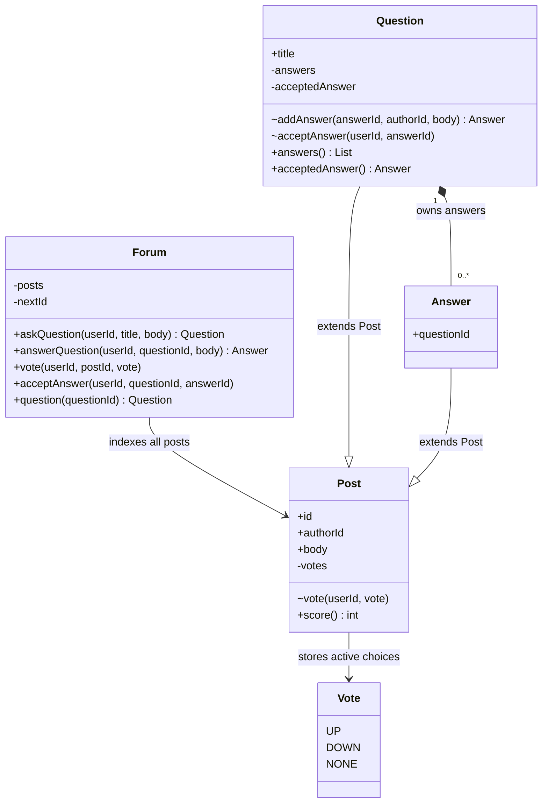

# Design Stack Overflow

> **Interview frame:** 60 minutes | Mid-level, approximately 4 years of experience | Java

## Understanding the Problem

A developer asks a question. Other developers answer it. Readers vote on useful questions and answers, while the person who asked the question can mark one answer as accepted.

Two different judgments are involved: the community's score and the author's accepted answer. The highest-scoring answer need not be the accepted one. Keeping those facts separate is more important here than remembering every feature on the website.

> **Prompt:** Design the core of a Stack Overflow-style question-and-answer system.

We will build an in-memory domain component. Four years of experience is treated as mid-level for this exercise; actual interview expectations vary. The rules below are our agreed interview contract, not a claim to reproduce the website's complete policies.

### Clarifying Questions

**Candidate:** Which actions should we finish in this round?

**Interviewer:** Ask a question, answer it, read it with its answers, vote on either kind of post, and accept an answer.

That gives us a small public API. Comments, search, and reputation can wait. Reading a question returns its answers in posting order; we do not need a ranking algorithm.

**Candidate:** What happens if someone votes twice or changes their mind?

**Interviewer:** Each user has at most one active vote per post. They can choose upvote, downvote, or no vote. Repeating the same choice has no additional effect. Self-voting is rejected.

A score alone cannot tell us whether a user already voted. We must remember the user's current choice on each post.

**Candidate:** Who can accept an answer? Does accepting it close the question?

**Interviewer:** Only the question author can accept, and the answer must belong to that question. They can replace their choice. Further answers remain allowed. An author may answer their own question and accept that answer.

Acceptance belongs to the question. We need zero or one selected answer, with no separate closed state, waiting period, or explicit unaccept operation in this version.

**Candidate:** Which invalid actions should the component reject?

**Interviewer:** Unknown IDs, using an answer ID where a question is required, empty submitted content, self-votes, and invalid acceptance. A rejection must leave the existing posts, votes, and acceptance unchanged.

We will throw `IllegalArgumentException` for these caller mistakes. There is no need for an exception hierarchy.

**Candidate:** Do we implement accounts, storage, or simultaneous requests?

**Interviewer:** Assume authenticated user IDs are supplied. Store a small amount of data in memory and process calls sequentially. Discuss concurrency as a follow-up.

User identity can stay an integer. Ordinary maps are enough, and we can derive scores by scanning a post's current votes.

### Final Requirements

1. Create a question with an author, title, and body. Assign a unique post ID within this forum instance.
2. Add an answer to an existing question, remembering its author and question ID. Answers receive IDs from the same sequence as questions.
3. Retrieve a question with its content, answers in posting order, scores, and current accepted answer, if any.
4. Support `UP`, `DOWN`, and `NONE` on either kind of post. Keep at most one active vote per user per post; repeated choices are idempotent.
5. Reject self-voting. A post's score is the sum of its current votes, with upvotes worth +1 and downvotes worth -1.
6. Let only the question author accept an answer from that question. Repeating or replacing a valid choice is allowed, including acceptance of their own answer.
7. Reject invalid submissions and identifiers before publishing changes. Rejected voting and acceptance preserve the previous state.

### Out of Scope

- Comments, tags, keyword search, and answer sorting.
- Reputation, badges, moderation, editing, and deletion.
- Account registration, authentication, and authorization infrastructure.
- HTTP endpoints, UI, databases, and external services.
- Concurrent callers, distributed coordination, and crash recovery.
- Exact website policies such as eligibility thresholds or timing restrictions.

### Setup Assumptions

The caller already knows the authenticated user's stable ID. We do not check whether it is positive or load a user profile. IDs generated inside `Forum` are trusted; the interview data will not exhaust an integer.

Submitted title/body text, chosen post IDs, vote choices, and acceptance requests are runtime inputs. They can be wrong even though our demo supplies valid examples. A blank-body check therefore belongs in this problem. Rechecking an internally generated answer ID or validating every field of the resulting answer would add no useful protection.

All callers use `Forum` for mutations. Domain constructors and mutation methods are package-private, so the demo and other outside packages cannot bypass that entry point. Returned objects expose immutable content and read methods. Memory exhaustion and process failure are outside the rejection guarantee.

## Finding the Core Entities

Start with the nouns in the requirements, before inventing a hierarchy.

| Candidate | Keep as | Reason |
|---|---|---|
| Forum | Stateful orchestrator | Finds posts, assigns IDs, and routes user actions |
| Question | Stateful class | Owns the answer collection and accepted choice |
| Answer | Domain class | Has its own identity, author, content, votes, and fixed parent question |
| User | Integer identifier | We only need identity for ownership and voting; profiles have no behavior in scope |
| Vote | Enum plus a per-post map entry | Three commands, with only UP or DOWN retained as active votes |
| Score | Derived integer | It is the sum of current votes |
| Accepted answer | Question field | It is a relationship, without an independent lifecycle |
| Repository, search engine | Defer | Neither persistence nor searching is required |

Questions and answers both need an ID, author, body, and identical voting behavior. The caller also wants one `vote(userId, postId, choice)` operation for both. That is enough shared behavior to earn an abstract `Post` class. `Question` and `Answer` form a shallow hierarchy; voting will not branch on their types.

### Responsibilities at a Glance

| Type | Responsibility | Authoritative state or rule |
|---|---|---|
| `Forum` | Public command routing and lookup | Global post IDs and the post index |
| `Post` | Shared content and voting | A user's current vote and the self-vote restriction |
| `Question` | Question-specific relationships | Its answers and zero or one accepted answer |
| `Answer` | A reply to one question | Immutable `questionId`, plus inherited post state |
| `Vote` | Closed set of caller choices | UP = +1, DOWN = -1, NONE removes a vote |

## Class Design

### `Forum`: one place to enter the component

The caller should not look through collections to find the object that owns an action. `Forum` resolves IDs and delegates. It does not calculate scores or decide whether an answer is eligible for acceptance.

| Requirement | State needed | Why here |
|---|---|---|
| Find either kind of post by ID | `posts: Map<Integer, Post>` | Voting needs one shared index |
| Assign IDs across both kinds | `nextId` | One allocator prevents collisions between questions and answers |

| Caller need | Method | Result or mutation |
|---|---|---|
| Publish a question | `askQuestion(userId, title, body)` | Creates, indexes, and returns a `Question` |
| Reply to a question | `answerQuestion(userId, questionId, body)` | Attaches, indexes, and returns an `Answer` |
| Set the current vote | `vote(userId, postId, vote)` | Resolves a `Post`, then delegates |
| Choose an answer | `acceptAnswer(userId, questionId, answerId)` | Resolves a `Question`, then delegates |
| Read a question | `question(questionId)` | Returns it, rejecting a missing or wrong-kind ID |

```text
Forum
  posts: Map<Integer, Post>
  nextId: int
  askQuestion(userId, title, body): Question
  answerQuestion(userId, questionId, body): Answer
  vote(userId, postId, vote): void
  acceptAnswer(userId, questionId, answerId): void
  question(questionId): Question
  private post(postId): Post
```

The private `post()` helper centralizes the failed-lookup check used by voting and question lookup. The `instanceof Question` check in `question()` validates the kind of ID the caller supplied. It is not a type switch implementing separate voting algorithms.

**Invariant:** Published post IDs are unique. Every answer attached to a question has the same object reference in the global index. The answer is not copied, and its votes have only one owner.

**Collaborators:** `Forum` creates questions, asks questions to create answers, and invokes the domain mutations. Only this class allocates IDs and modifies `posts`.

### `Post`: shared voting, earned by two real callers

`Post` stores the content common to questions and answers. Its body is immutable after creation because editing is outside scope. Voting is the changing part.

#### Decision: how much state does a score need?

Suppose user 40 upvotes answer 2 twice, then changes that vote to a downvote. The required scores are `1, 1, -1`.

**Bad: change a counter on every request.** A simple `score += choice` produces `1, 2, 1`. It cannot distinguish a retry from a second voter, or replacement from an additional vote. The counter has discarded information the requirements need.

**Good: remember votes and maintain a cached score.** Store `userId -> current vote`. For each change, update the score by `newValue - oldValue`. The same sequence now produces `1, 1, -1`. Reads are constant-time, but every write must keep the map and score synchronized, including removal.

**Great for this bounded interview: remember votes and derive the score.** Keep that map and sum its values when asked. The replay still produces `1, 1, -1`, with no second mutable total to maintain. A score read costs O(V), where V is the post's number of active voters. That is the explicit price of the simpler invariant.

**Recommendation: Implement in interview.** Use the map and derived score. Mention a cached score if frequent reads become a stated requirement; it is a valid alternative, not an automatic improvement.

| Requirement | State needed | Why here |
|---|---|---|
| Identify and display a post | Immutable `id`, `authorId`, `body` | Both kinds share these facts |
| One active vote per user | `votes: Map<Integer, Vote>` | A repeated key replaces the existing choice |
| Show the score | No score field | Sum the map's active choices |

| Caller or domain need | Method | Result or mutation |
|---|---|---|
| Initialize submitted content | Package-private constructor | Checks the body once and assigns immutable fields |
| Apply a routed vote | Package-private `vote(userId, vote)` | Rejects self-votes, then replaces or removes an entry |
| Read community feedback | Public `score()` | Sums votes without changing state |

```text
abstract Post
  immutable id, authorId, body
  private votes: Map<Integer, Vote>
  package vote(userId, vote): void
  public score(): int
```

**Invariant:** The map contains at most one UP or DOWN entry per user, and no entry for the author. NONE is a command to remove an entry. No persistent vote object or vote history is needed.

**Collaborators:** `Forum` checks that a vote choice is non-null and resolves the post before calling `Post.vote()`. `Post` knows nothing about the global index, answer acceptance, or reputation. The derived score is shared through inheritance.

### `Question`: own the answer collection and accepted choice

A question adds a title and a collection of answers to the shared post state. Its `LinkedHashMap` gives both lookup by answer ID and deterministic posting order.

#### Decision: accepted flags or one reference?

An `accepted` boolean on each answer initially looks convenient for display. After accepting answer 2, a replacement path might mark answer 3 without clearing answer 2. Both now say accepted. Correcting that design requires coordinating the old and new answers on every replacement.

Store `acceptedAnswer` on the question instead. Changing from answer 2 to answer 3 is one assignment after validation. There is no combination of this field that names two answers. The cost is that a caller checks the question's selection when displaying a badge, rather than asking an answer for an independent flag.

**Recommendation: Implement in interview.** One reference matches a single choice. Keep voting and acceptance independent: accepting an answer does not increase its score.

| Requirement | State needed | Why here |
|---|---|---|
| Display a question heading | Immutable `title` | Answers have no separate title |
| Own answers and preserve order | `answers: LinkedHashMap<Integer, Answer>` | The collection defines membership |
| Select zero or one answer | Nullable `acceptedAnswer` | A single reference represents the author's choice |

| Caller or domain need | Method | Result or mutation |
|---|---|---|
| Attach a new answer | Package-private `addAnswer(answerId, authorId, body)` | Creates it with this question's ID, then inserts it |
| Accept or replace an answer | Package-private `acceptAnswer(userId, answerId)` | Checks authority and local membership, then assigns |
| Read answers in order | Public `answers()` | Returns an unmodifiable list copy |
| Read the selection | Public `acceptedAnswer()` | Returns the selected answer or null |

```text
Question extends Post
  immutable title
  private answers: Map<Integer, Answer>
  private acceptedAnswer: Answer or null
  package addAnswer(answerId, authorId, body): Answer
  package acceptAnswer(userId, answerId): void
  public answers(): List<Answer>
  public acceptedAnswer(): Answer or null
```

**Invariant:** Each attached answer belongs to this question. The accepted reference is either null or an answer in this collection. Only a request carrying the question author's ID can change it.

**Collaborators:** `Forum` supplies a fresh ID; `Question` constructs the `Answer` and owns membership. Answer creation validates submitted body text through `Post` before insertion. Acceptance looks up the answer in this local map, so an existing answer from another question still fails.

The list copy protects membership from outside mutation. Its answer objects remain live: later votes can change their scores. It is not a historical snapshot. `Question` has no knowledge of other questions or the forum-wide allocator.

### `Answer`: a post with one fixed parent

`Answer` is a small subclass because an answer already gets identity, text, and voting from `Post`. Its additional fact is which question it answers.

| Requirement | State needed | Why here |
|---|---|---|
| Identify an answer's parent | Immutable `questionId` | A returned answer can identify its question without a global scan |
| Display and vote on the answer | Inherited post state | The rules are identical for both post kinds |

| Domain or caller need | Method | Result |
|---|---|---|
| Create a reply | Package-private constructor | Initializes shared content and the parent ID supplied by `Question` |
| Read score | Inherited `score()` | Uses the same vote representation |

```text
Answer extends Post
  immutable questionId
  package constructor(id, authorId, body, questionId)
  inherited public score(): int
```

**Invariant:** An answer never moves between questions. `questionId` comes directly from its creating question, so the constructor does not query the forum to validate it again.

**Collaborators:** `Question` creates it; `Forum` indexes it and routes voting to the inherited behavior. An answer does not decide whether it is accepted. That would give it responsibility for its parent's choice.

### `Vote` and the demonstration

`Vote` is an enum because the public operation has three legal choices. Its fixed values are trusted code, so the enum constructor only assigns the value field.

```text
Vote
  UP = +1
  DOWN = -1
  NONE = 0, meaning remove

Main
  main(args): run one deterministic example through Forum
```

`Main` owns no domain state beyond references used by the example. It belongs in a separate package so it exercises the same boundary as a normal caller. The implementation needs no user class, voting strategy, repository interface, or custom exception.

## Final Class Design

The diagram omits routine constructors. `~` means package-private. `Forum` is the mutation entry point; `Post` protects voting; `Question` protects membership and acceptance. The same answer object is reachable from its question and the global index. Only the question stores the accepted choice.



## Core Implementation

Type the small classes and enum first, then the forum and demo. Three operations deserve most of the explanation. The appendix contains exactly this implementation, including the ordinary constructors and read methods.

### 1. Set a vote, rather than count a click

The happy path resolves a post and records the user's chosen direction. NONE removes the entry. An absent vote can be removed repeatedly without changing the result.

```text
Forum.vote(userId, postId, choice):
  reject a null choice
  resolve postId, or reject the missing post
  delegate to that Post

Post.vote(userId, choice):
  reject if userId is the author
  if choice is NONE, remove userId
  otherwise set votes[userId] to choice
```

Here is the complete mutation inside `Post`:

```java
void vote(int userId, Vote vote) {
    if (userId == authorId) {
        throw new IllegalArgumentException("Cannot vote on your own post");
    }
    if (vote == Vote.NONE) {
        votes.remove(userId);
    } else {
        votes.put(userId, vote);
    }
}
```

The public boundary rejects null because allowing it into the map would break a later score read. The domain method does not repeat that check. It owns the author rule because it owns `authorId`. All guards precede the map mutation.

No special branch handles a repeated vote or a direction change. Assigning the same map key already has the desired behavior.

### 2. Accept only an answer from this question

This operation has two independent conditions: the caller is authorized, and the target is eligible. A globally existing answer satisfies neither condition by itself.

```text
Forum resolves the question, or rejects the ID
Question checks that the caller is its author
Question looks up answerId in its own answers map
If no answer exists there, reject
Assign acceptedAnswer to that answer
```

The local lookup performs the membership check; a second search through the global index would add no information.

```java
void acceptAnswer(int userId, int answerId) {
    if (userId != authorId) {
        throw new IllegalArgumentException("Only the question author can accept");
    }
    Answer answer = answers.get(answerId);
    if (answer == null) {
        throw new IllegalArgumentException("Answer does not belong to this question");
    }
    acceptedAnswer = answer;
}
```

Suppose answer 2 is already accepted. If the caller supplies an answer from question 8, the local lookup fails before the assignment. Answer 2 stays accepted. We never clear the old choice first, so no rollback is needed.

Accepting the same answer again is harmless. Replacing it changes one reference. Accepting the author's own answer is allowed because authority is checked against the question author, not against the answer author. No vote or score changes during this operation.

### 3. Publish an answer without splitting ownership

An answer appears in two collections: its question's ordered answer map and the forum's post index. They must reference the same instance.

```text
resolve questionId and verify that it names a Question
ask that Question to create an Answer using nextId
  validate the submitted body during construction
  attach the successfully created Answer
index the same Answer under nextId
advance nextId and return the Answer
```

The forum coordinates publication while the question handles construction and attachment:

```java
public Answer answerQuestion(int userId, int questionId, String body) {
    Question question = question(questionId);
    Answer answer = question.addAnswer(nextId, userId, body);
    posts.put(nextId++, answer);
    return answer;
}
```

A bad question ID fails before construction. A blank body fails before attachment. Once attachment succeeds, no further domain validation can reject the request. Sequential calls prevent another caller from observing the interval before indexing. This is an in-memory operation under our contract, not a database transaction or a crash-recovery guarantee.

### Operation costs

Let A be the number of answers to the selected question, and V the number of active voters on the selected post. These costs exclude reading the submitted strings and assume the vote map's capacity is proportional to V. After heavy vote removal, Java's `HashMap` can retain a larger capacity, which also contributes to iteration cost.

| Operation | Cost under ordinary hash-map assumptions |
|---|---|
| Create a question, add an answer | O(1) expected collection work |
| Set, change, or remove a vote | O(1) expected |
| Accept an answer, retrieve a question | O(1) expected |
| Read one score | O(V) |
| Obtain the ordered answer list | O(A) time and temporary space for its copy |

Rendering every answer's score additionally scans those answers' vote maps. Total retained state grows with posts and active votes. Removed votes leave no history.

## Complete Runnable Implementation

The application uses only the Java standard library. It was compiled and run with OpenJDK **25.0.4.1**, without preview features or external dependencies.

```text
solution/
  src/
    main/java/stackoverflow/
      domain/
        Forum.java
        Post.java
        Question.java
        Answer.java
        Vote.java
      demo/
        Main.java
    test/java/stackoverflow/
      SolutionTest.java
```

The `domain` package contains one cohesive component, including its orchestrator. Keeping these collaborators together lets their constructors and mutations remain package-private. A separate service package would require widening those methods or adding another access mechanism without a requirement for it. `demo` and tests are outside this boundary. No build tool is required for seven source files.

Read the complete sources: [Post.java](solution/src/main/java/stackoverflow/domain/Post.java), [Question.java](solution/src/main/java/stackoverflow/domain/Question.java), [Answer.java](solution/src/main/java/stackoverflow/domain/Answer.java), [Vote.java](solution/src/main/java/stackoverflow/domain/Vote.java), [Forum.java](solution/src/main/java/stackoverflow/domain/Forum.java), and [Main.java](solution/src/main/java/stackoverflow/demo/Main.java). The [focused tests](solution/src/test/java/stackoverflow/SolutionTest.java) are additional study support.

From the `solution/` directory, run:

```bash
mkdir -p out
javac -Xlint:all -d out $(find src/main/java src/test/java -name '*.java' | sort)
java -ea -cp out stackoverflow.SolutionTest
java -cp out stackoverflow.demo.Main
```

Compilation completed without warnings. The observed output was:

```text
7 focused tests passed
Question #1 score=1
Answer #2 score=-1
Answer #3 score=0
Accepted answer: #3
```

Keep `-ea` in the test command; the test runner uses Java assertions. The PDF generated from this Markdown includes every application and test file in **Appendix: Complete Runnable Code**, with a source checksum manifest. The PDF alone contains the commands and code needed to reproduce this result.

### Does the whole implementation fit?

The five domain files total **153 physical lines**. The short demo adds **27**, for **180 application-and-demo lines**, including imports, blanks, constructors, and read methods. There is no larger implementation hidden in the appendix. The seven focused test methods and their small runner occupy another 127 lines and are study support, not expected interview typing.

| Part of the round | Budget |
|---|---|
| Clarify the contract | 5 minutes |
| Derive classes and discuss the two state decisions | 10 minutes |
| Type all domain classes and the short demo | 30 minutes |
| Run it and trace a rejection | 5 minutes |
| Follow-ups and corrections | 10 minutes |

The application has small constructors, ordinary collection operations, and three substantive mutation flows. That makes 30 minutes a plausible implementation allowance for a prepared mid-level candidate; the line count is not a typing-speed guarantee. Practice the complete version. If it takes much longer, revisit the scope with the interviewer rather than omitting correctness from voting or acceptance.

## Verification Walkthrough

Start with a new `Forum`. User 10 asks question 1. Users 20 and 30 submit answers 2 and 3. Both answers are attached to question 1 and indexed by the same references. All scores are zero; the accepted answer is null.

| Public call | Owner and check | Resulting state |
|---|---|---|
| `vote(40, 1, UP)` | `Forum` resolves the question; `Post` checks author 10 | Question score = 1 |
| `vote(40, 2, UP)` | Answer's `Post` checks author 20 | Answer 2 has `{40: UP}`, score = 1 |
| `vote(40, 2, UP)` again | Same map key is assigned | Still one vote, score = 1 |
| `vote(40, 2, DOWN)` | Same key is replaced | Answer 2 has `{40: DOWN}`, score = -1 |
| `acceptAnswer(10, 1, 2)` | Question 1 verifies its author and answer membership | Accepted answer = 2 |
| `acceptAnswer(10, 1, 3)` | The same checks pass for answer 3 | Accepted answer = 3; scores unchanged |

That is the supplied demo. For the rejection trace, attempt `acceptAnswer(20, 1, 2)` next. The question's authority check fails and the accepted reference remains answer 3. Supplying an answer from a different question would instead fail the local membership lookup, with the same unchanged result.

The automated tests exercise seven distinct areas: posting and ordered reads; vote repetition, replacement, and removal on both post kinds; rejected votes preserving scores; acceptance and replacement including a self-answer; rejected acceptance preserving the old choice; unknown and wrong-kind IDs; and invalid content not being published. They do not enumerate malformed hardcoded setup.

## Extensibility

### Comments, tags, and search: add the requested slice

**Mention if asked.** Comments can be small immutable records in a collection on `Post`, since both questions and answers can receive them. Expose a `Forum.addComment()` operation and a read method; do not make comments votable by inheritance unless required.

Tags belong on `Question`. For a small tag or title search, scan questions first and specify matching rules. Add an index only when the required query cost justifies maintaining it. These features leave the vote map and accepted-reference design intact.

### Faster score reads: introduce one explicit synchronization rule

**Mention if asked.** Cache a score on `Post` and update it by the difference between the new and old vote values. NONE contributes zero. Every vote mutation must preserve `cachedScore == sum(current votes)`, including retries and removal. The existing vote-lifecycle tests become particularly useful. This trades simpler reads for more write-side responsibility.

### Concurrent calls: protect the complete operation and the read

**Mention if asked; not implemented.** Two threads can read the same `nextId` while publishing answers, then overwrite one another in `posts`. An ordinary vote map is also unsafe to mutate while another thread iterates it for `score()`.

A coarse forum lock is a reasonable first proposal for small workloads. Hold it across ID allocation, attachment, indexing, and publication, and across other state mutations. Reads must use the same protection. The current API returns live objects, so merely adding `synchronized` to `Forum` methods is insufficient: `question.score()` would still run outside that lock.

Introduce query methods that construct immutable question/answer snapshots under the same forum lock and return those snapshots. Then concurrent callers cannot observe a half-published answer or iterate a changing vote map. Add a concurrent creation test for unique IDs and complete membership. Fine-grained locks require a new contention goal and an explicit lock order.

### Persistent storage and reputation: revisit multi-object effects

**Production extension.** Persistence requires transactions around answer publication and uniqueness for a user's vote on a post. The database becomes authoritative; the in-memory maps no longer define durability.

Reputation introduces state on another entity. Agree on its scoring policy before coding, then apply the effect of replacing or removing a vote exactly once alongside the vote change. Do not award points again for an identical repeated choice. These are additional invariants, so a reputation counter should not be slipped into the base `vote()` method without revisiting the transaction boundary.

## What Is Expected at Each Level

### Junior

Identify questions and answers, attach answers to the correct question, and make voting and acceptance work. An interviewer may help uncover the duplicate-vote case or suggest storing votes by user. A coherent solution and a concrete execution trace matter more than naming patterns.

### Mid-level

For someone with **four years of experience**, aim to discover the repeat-vote and foreign-answer cases without prompting. Explain why the vote map is necessary, defend derived versus cached score, and give each invariant a clear owner. Keep mutation behind the public boundary, organize the code sensibly, and complete the small runnable implementation.

You should also recognize that returning live mutable objects complicates a concurrency follow-up. You do not need to implement reputation, a database, or a plugin framework to demonstrate mid-level judgment. Spend the round making the chosen behavior correct and explainable.

### Senior

Proactively test the ownership and failure assumptions: who authenticates the supplied identity, what a reader can observe during publication, and what changes if deletion or reputation is added. Explain a complete concurrency boundary rather than locking one map operation. Keep those discussions localized; seniority does not make a larger base implementation necessary.
