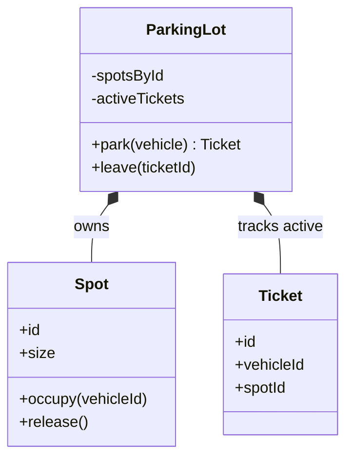
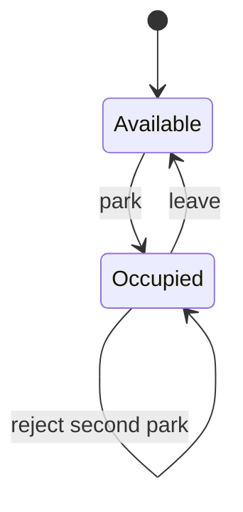
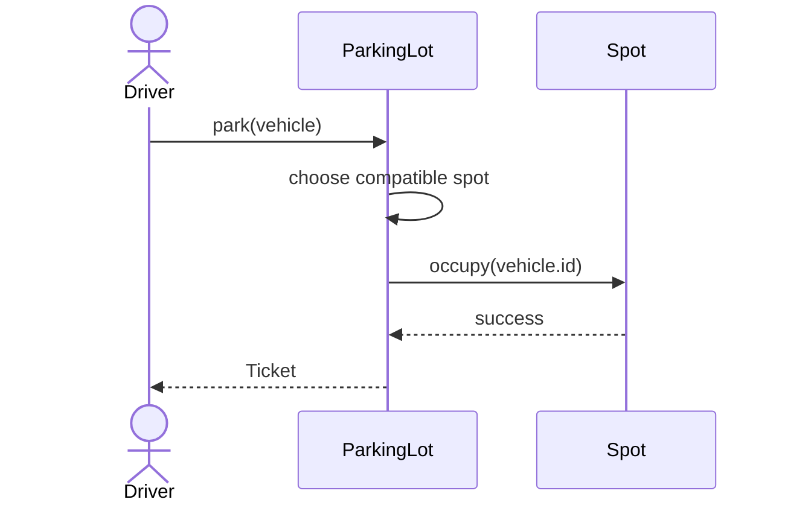
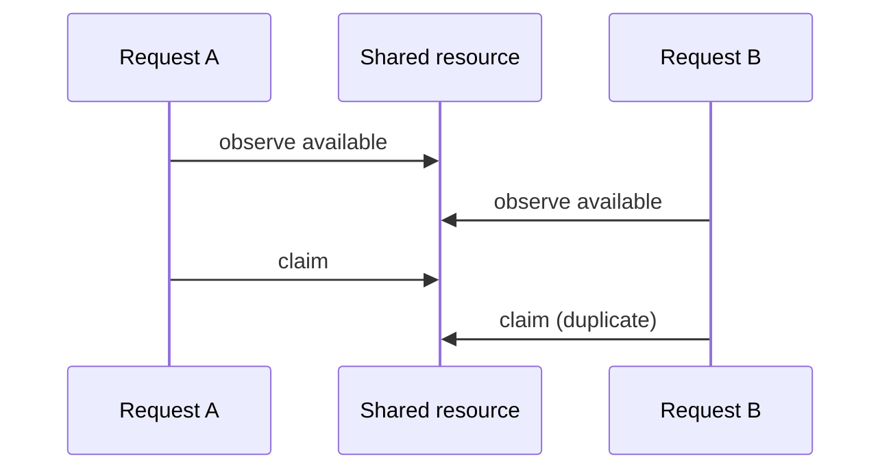

# Diagram Guidance

Use diagrams to compress relationships or transitions that would otherwise require several paragraphs. Prefer UML-lite Mermaid in Markdown: accurate enough to teach, small enough to scan during interview preparation, and suitable for vector rendering in the paired PDF.

## Global rules

- Include one class diagram for a non-trivial multi-class design. Draw the selected design, not every alternative. A tiny diagram inside a comparison is acceptable when it exposes the flaw.
- Use the exact class, method, and state names from the article and code.
- Keep a primary diagram near seven nodes or fewer. Split independent concerns instead of producing a wall of boxes.
- Show only members that matter to the current design argument.
- Label ownership, multiplicity, or direction when ambiguity would change the design.
- Explain the diagram in one short paragraph. Never make the reader reverse-engineer the lesson.
- Recheck diagrams after changing the implementation.

## Show behavior, not just architecture

At the hardest decision, ask what the reader needs to picture. Good choices include two object snapshots before/after a command, a worked board or resource layout, the same requests under two policies, and a rejected transition. Use the same identifiers as the text. A UML class diagram explains relationships; it cannot by itself explain a changing vote or a scheduling outcome.

Write a one-sentence takeaway caption before drawing, and place that caption below the figure. Give each figure one teaching job. Keep a consistent visual vocabulary: stable facts subdued, changed state accented, rejected operation labeled explicitly. Never make color the only carrier of meaning. Prefer a few readable panels to one crowded diagram. Translate animations into static key frames for the PDF.

Create original vector assets when Mermaid is a poor fit. Store local SVG or PNG assets under the bundle's `figures/`, reference them with standard Markdown image syntax, and supply meaningful alt text. SVGs must be self-contained: no scripts, imported fonts, external images, or remote references. Avoid stock photos, copied publisher artwork, and generated decoration. The smallest useful visual wins; there is no image-count quota.

## UML-lite class diagram

Use for ownership, composition, and real polymorphic boundaries.

Avoid listing getters, constructors, and utility methods that do not affect the reasoning.

## State diagram

Use when legal behavior depends on a lifecycle.

Include invalid or ignored transitions only when their behavior is an interview requirement. Match terminal states and error semantics to the code.

## Sequence diagram

Use for a workflow crossing at least three meaningful participants, or for mutation ordering.

Keep happy-path sequences short. Add an `alt` block only when the alternative illuminates an invariant or error path.

## Concurrency and race diagrams

Show the unsafe interleaving before presenting a lock or atomic operation.

Then show or state the complete critical section: validation, selection, mutation, and publication. A lock around only the final assignment does not repair an earlier stale decision.

## Data-structure sketch

Mermaid has no dedicated data-structure notation. Use a small flowchart for indices and links, or a class diagram for an internal node. Accompany it with the operation complexity it enables.

## Diagram release check

Before publishing, verify:

1. Every Mermaid diagram parses, and every local figure resolves and renders.
2. Names match the final design and implementation.
3. Arrows express the intended ownership or call direction.
4. The prose states what the reader should notice.
5. The class diagram covers central ownership and collaboration without becoming a member dump.
6. Any additional state, sequence, race, or data-structure diagram would make the explanation materially harder if removed; otherwise remove it.

Render diagrams in both output formats. `scripts/build_pdf.py` supports compact class, state, and sequence diagrams. If a required construct falls back to source text in the PDF, either simplify the diagram to supported UML-lite syntax or use a renderer that can embed it. Do not claim visual validation from syntax inspection alone.

Check arrowheads and multiplicities in the PDF, not only in the Markdown source. A renderer that turns inheritance or composition into a generic arrow changes the lesson. Check text size at page scale; reduce the content before shrinking labels. Local SVGs use the optional `svglib` package in the PDF builder; raster figures use ReportLab's image support.
