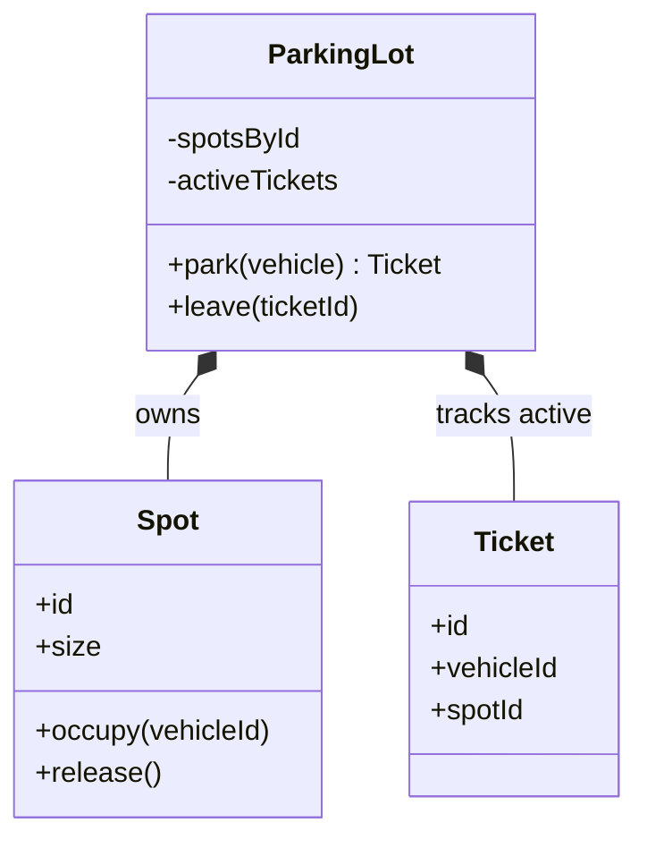
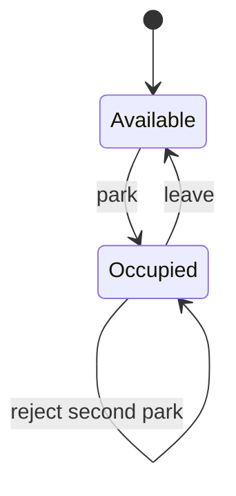
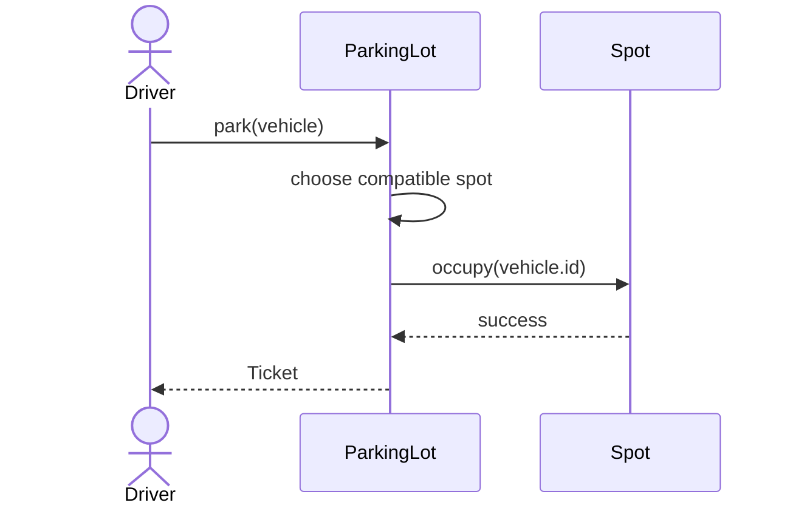
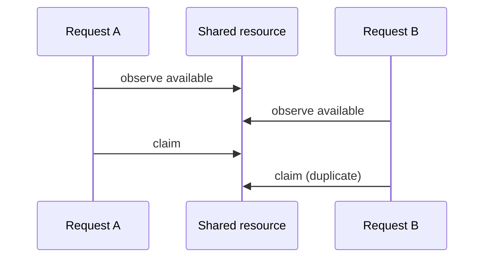

# Diagram Guidance

Use diagrams to compress relationships or transitions that would otherwise require several paragraphs. Prefer UML-lite Mermaid: accurate enough to teach, small enough to scan during interview preparation.

## Global rules

- Draw the selected design, not every alternative. A tiny diagram inside a comparison is acceptable when it exposes the flaw.
- Use the exact class, method, and state names from the article and code.
- Keep a primary diagram near seven nodes or fewer. Split independent concerns instead of producing a wall of boxes.
- Show only members that matter to the current design argument.
- Label ownership, multiplicity, or direction when ambiguity would change the design.
- Explain the diagram in one short paragraph. Never make the reader reverse-engineer the lesson.
- Recheck diagrams after changing the implementation.

## UML-lite class diagram

Use for ownership, composition, and real polymorphic boundaries.

Avoid listing getters, constructors, and utility methods that do not affect the reasoning.

## State diagram

Use when legal behavior depends on a lifecycle.

Include invalid or ignored transitions only when their behavior is an interview requirement. Match terminal states and error semantics to the code.

## Sequence diagram

Use for a workflow crossing at least three meaningful participants, or for mutation ordering.

Keep happy-path sequences short. Add an `alt` block only when the alternative illuminates an invariant or error path.

## Concurrency and race diagrams

Show the unsafe interleaving before presenting a lock or atomic operation.

Then show or state the complete critical section: validation, selection, mutation, and publication. A lock around only the final assignment does not repair an earlier stale decision.

## Data-structure sketch

Mermaid has no dedicated data-structure notation. Use a small flowchart for indices and links, or a class diagram for an internal node. Accompany it with the operation complexity it enables.

## Diagram release check

Before publishing, verify:

1. Every diagram parses as Mermaid.
2. Names match the final design and implementation.
3. Arrows express the intended ownership or call direction.
4. The prose states what the reader should notice.
5. Removing the diagram would make the explanation materially harder; otherwise remove it.

Render diagrams with a Mermaid-capable tool when one is available. If no renderer is installed, inspect the syntax manually and state that the diagrams were not mechanically rendered; do not fold that limitation into a generic “validation passed” claim.
